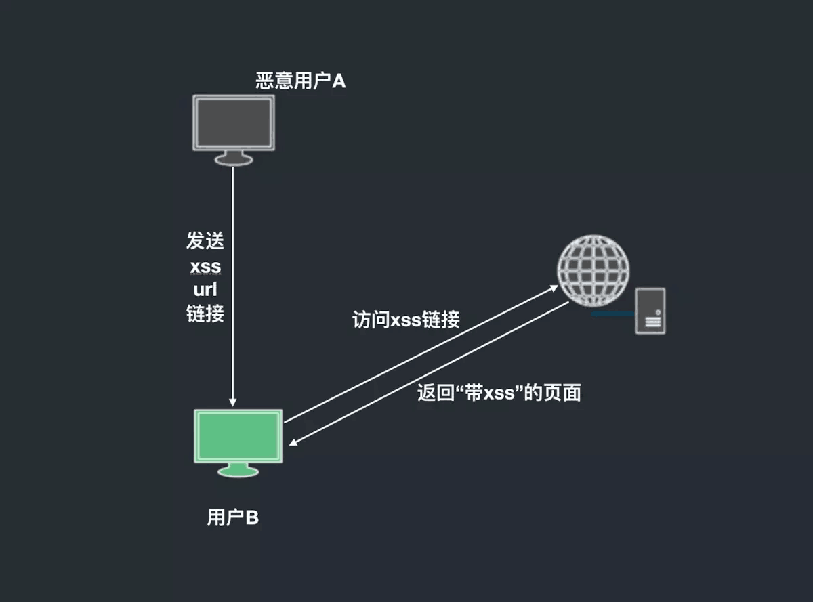
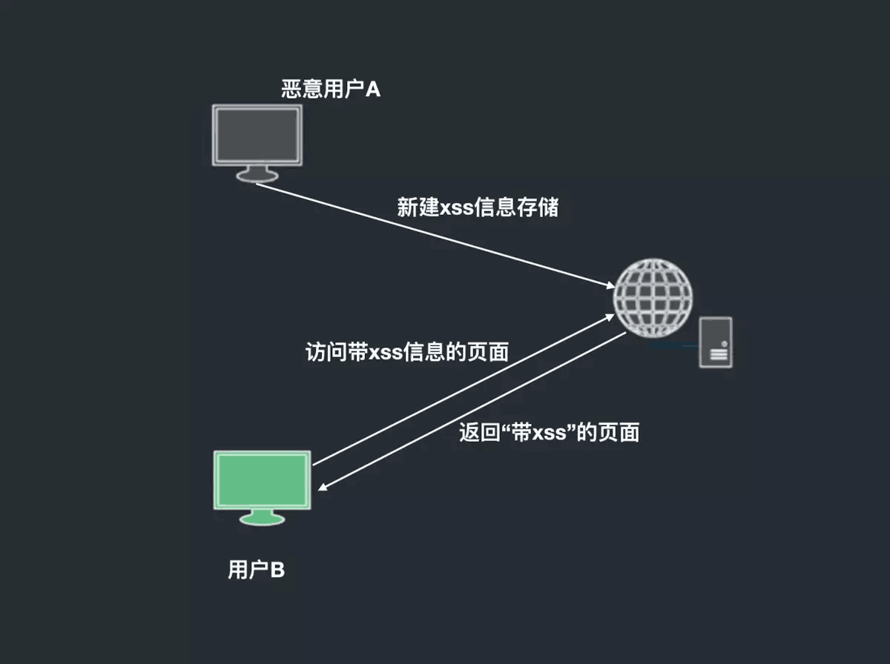
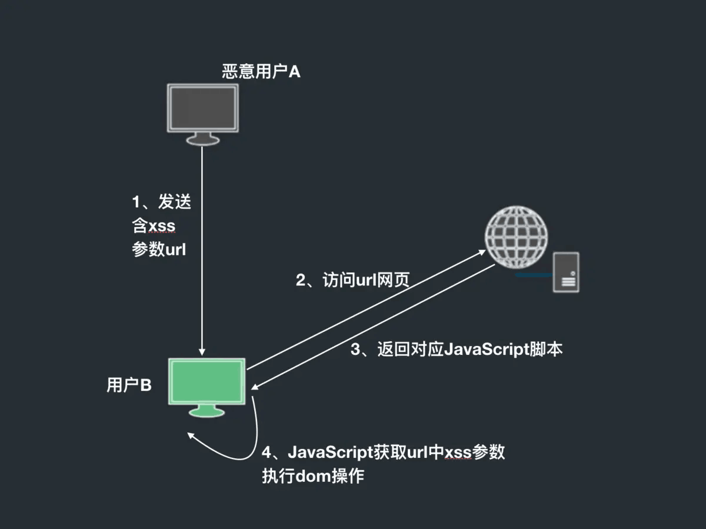
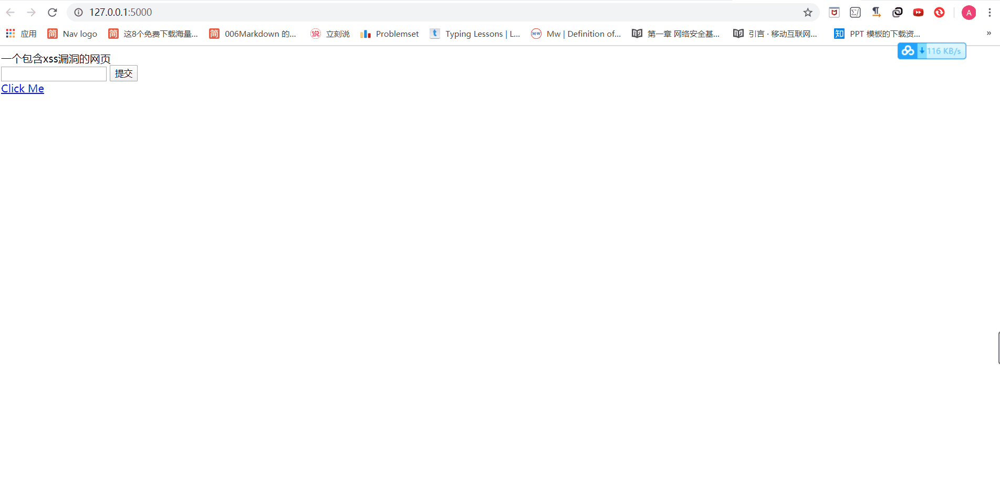
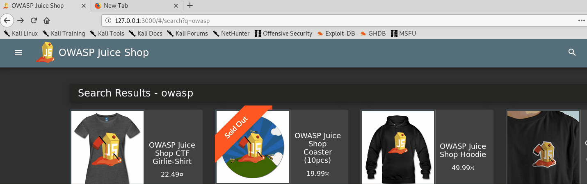
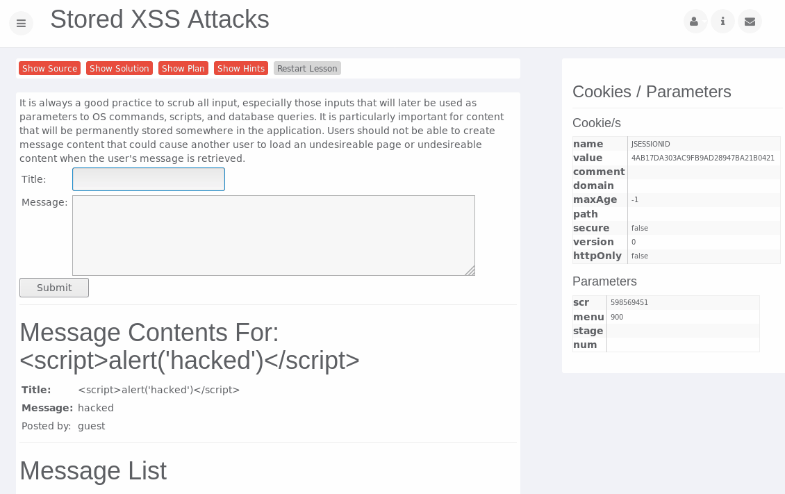

# XSS 攻击实验

## 1 实验要求

1. 编写一个`html`网站页面(含有提交框和显示框)，然后向提交框提交一份代码，在显示框显示。如果是文本就储存在数据库中，直接显示文本；如果是恶意代码，会在浏览器中执行。
2. 机器人模拟这个提交代码触发漏洞的过程。

## 2 实验环境

1. `html`网页；
2. `chromedriver.exe`；
3. 机器人模拟的`robot.py`代码。

## 3 相关概念

XSS：`Cross Site Scripting`跨站脚本，Web前端漏洞。当用户浏览器渲染HTML文档的过程中，出现了不被预期的脚本指令并执行。

|类型|解释|图示|区别|例子|
|---|---|---|---|---|
|反射型XSS(非持久型) Reflected XSS|将XSS代码(含有可执行的脚本元素)写在发出请求的URL中->提交到服务器端->服务器端解析后响应，XSS代码随响应内容一起传回给浏览器->浏览器解析执行XSS代码||经过后端，不经过数据库|攻击者事先做好攻击链接，欺骗用户点击链接后触发，容易出现在搜索界面|
|存储型XSS(持久型) Stored XSS|提交的代码会存储在服务器端(数据库，内存，文件系统等),下次请求目标页面时不用再提交XSS代码||经过后端，经过数据库|留言板XSS：攻击者提交包含XSS代码的留言存储到数据库->目标用户查看留言板时->留言的内容会从数据库查询出来并显示，浏览器把XSS代码当做正常的HTML与Js解析执行->触发XSS攻击|带有script和img等标签|
|Dom-based XSS|DOMXSS代码并不需服务器参与，客户端的脚本程序可以动态地检查和修改页面内容，从客户端获得DOM中的数据在本地执行，而不依赖于服务器端的数据||不经过后端,通过url传入xss，未过滤并在本地执行dom的渲染操作触发|输入来源：`document.location、document.URL、document.URLUnencoded、document.referrer、window.location`等，触发api有`document.write()、document.writeln()、document.innerHtml、eval()、window.execScript()、window.setInterval()、window.setTimeout()`等|

## 4 实验过程

### 4.1 编写网页

- 用`flask`框架实现前后端的交互
  - 编写`test.py`文件
    ```python
    from flask import Flask,request,render_template
    app=Flask(__name__)
    @app.route('/')
    def formpost():
        tex = 'javascript:alert(\'xss\')'
        if request.args.get('text'):
            tex = request.args.get('text')
        # print(tex)
        # 前端提交表单输入的text会通过flask传给前端的data，用于显示
        # 此时可以通过提交恶意代码，在前端显示
        return render_template('show.html',data=tex)
    if __name__=='__main__':
        app.run(debug=True)
    ```
  - 在同目录下新建`templates`目录，在里面写`show.html`。此时点击页面的链接，该链接重定向到`data`字段，所以会执行上一步传进来的恶意代码。
    ```html
    <!DOCTYPE html>
    <html lang="en">
    <head>
        <meta charset="UTF-8">
        <title>XSS攻击</title>
    </head>
    <body>
        <form method="GET">
            <input name="text" id="te">
            <input type="submit">
        </form>
        <a href="{{data}}" id="link">Click Me</a>  
    </body>
    </html>
    ```

### 4.2 触发漏洞

- 运行`test.py`文件，在文本框中输入正常的文字，则可以正常显示；在文本框中输入恶意代码，可以执行。
- 传入的代码如下
    ```html
    # 恶意代码
    javascript:alert('jdlnb!!');
    javascript:document.write('<h1>jdlnb!</h1>');
    ```
    
    

### 4.3 机器人模拟触发过程

- 编写[机器人触发的代码](robot.py)，其中选择的`chromedriver`一定要和自己的`chrome`浏览器的版本相对应。
    ```python
    # -*- coding: utf-8 -*-
    from selenium import webdriver
    from selenium.webdriver.common.keys import Keys
    from selenium.webdriver.chrome.options import Options
    import requests
    import time 
    import os
    import re
    import platform
    from lxml import etree
    from datetime import datetime

    # 登录相应网站
    class spider:
        chrome_driver_path=""
        driver=NotImplemented
        main_page_url = 'http://127.0.0.1:5000/'
        main_page_title = 'XSS攻击'

        headers = {'User-Agent':'Mozilla/5.0 (Windows NT 10.0; WOW64) AppleWebKit/537.36 (KHTML, like Gecko) '
                            'Chrome/51.0.2704.63 Safari/537.36'}
        cookies = None
        request_session = None

        def __init__(self):
            if platform.system()=='Windows':
                self.chrome_driver_path = "chromedriver.exe"
            elif platform.system()=='Linux' or platform.system()=='Darwin':
                self.chrome_driver_path = "./chromedriver"
            else:
                print('Unknown System Type. quit...')
                return None

            requests.headers = self.headers

            try:
                r = requests.get(self.main_page_url)
            except requests.exceptions.RequestException as e:
                print('链接异常，请检查网络')
                print(e)
                quit()

            if(r.status_code!=200):
                print('http状态码错误')
                quit()

            chrome_options = Options()
            # chrome_options.add_argument('--headless') # headless不会弹出用户界面，而后台运行 
            chrome_options.add_argument('--disable-gpu') # 设置driver的属性，去掉gpu加速
            self.driver = webdriver.Chrome(chrome_options=chrome_options, \
                executable_path= self.chrome_driver_path)

            return None

        def attack(self,str):
            self.driver.get(self.main_page_url)
            time.sleep(1)
            if self.driver.title!=self.main_page_title:
                print('不是期望的主页Title，网页改版了？')
                return False
            
            # xpath的方法 定位到文本框
            elem_text=self.driver.find_element_by_id("te")
            elem_text.send_keys(str)
            # 输入回车
            elem_text.send_keys(Keys.RETURN)
            
            time.sleep(1)
            
            # driver替我们点击
            link=self.driver.find_element_by_id("link")
            link.click()
            time.sleep(1)
            
            self.cookies = self.driver.get_cookies()
            self.request_session = requests.Session()
            for cookie in self.cookies:
                self.request_session.cookies.set(cookie['name'], cookie['value'])
            return True

    if __name__ == "__main__":
        xss=spider()
        xss.attack("javascript:alert('xss attacks')" 
    ```
- 触发过程如下
  
  

### 4.4 其他平台的xss漏洞攻击

- `Juiceshop`上的Domxss攻击
  
  

- `Webgoat`上的store-xss攻击
  
  

  - 在提交表单时，输入恶意代码并且提交。
  - 刚输入的恶意代码的信息被存储下来，并且显示在页面上。
  - 点击页面上的恶意代码，便可触发。

## 5 实验问题与解决

1. `flask jinja`会转义，把js代码变成大写字母或者是js中的alert去掉，所以无法触发
   处理方法：可以通过传递参数给href触发、onclick的函数时触发

## 6 实验总结

- xss漏洞的关键是`寻找参数未过滤的输出函数`
- 预防方法：
  - 输入过滤：在用户输入的参数进行过滤
    - 过滤掉`< >`等符号
    - 过滤或移除特殊的Html标签，例如`<script> / <iframe> / &lt; for < / &gt; for > / &quot for `
    - 过滤JavaScript事件的标签，例如`onclick onfocus onerror`
  - 输出过滤：将用户输入内容作为页面内容的时候必须经过检测与过滤。

## 7 参考资料

- [更改pip源至国内镜像](https://blog.csdn.net/lambert310/article/details/52412059)
- [老师的爬虫示例代码](https://code.aliyun.com/fwqcuc/spider_example.git)
- [chromedriver，需翻墙下载](https://chromedriver.chromium.org/downloads)
- [xss攻击概念](https://www.jianshu.com/p/2818a8b75aed)
- [跨站脚本漏洞(XSS)基础讲解](https://www.jianshu.com/p/4fcb4b411a66)
- [含有xss漏洞的网页教程](https://pentesterlab.com/exercises/xss_and_mysql_file/course)
- [XSS跨站脚本小结](https://www.cnblogs.com/xiaozi/p/5588099.html)
- [flask.jinja2模板中自动转义和取消转义的分析](https://blog.csdn.net/fanny_git/article/details/78072690)