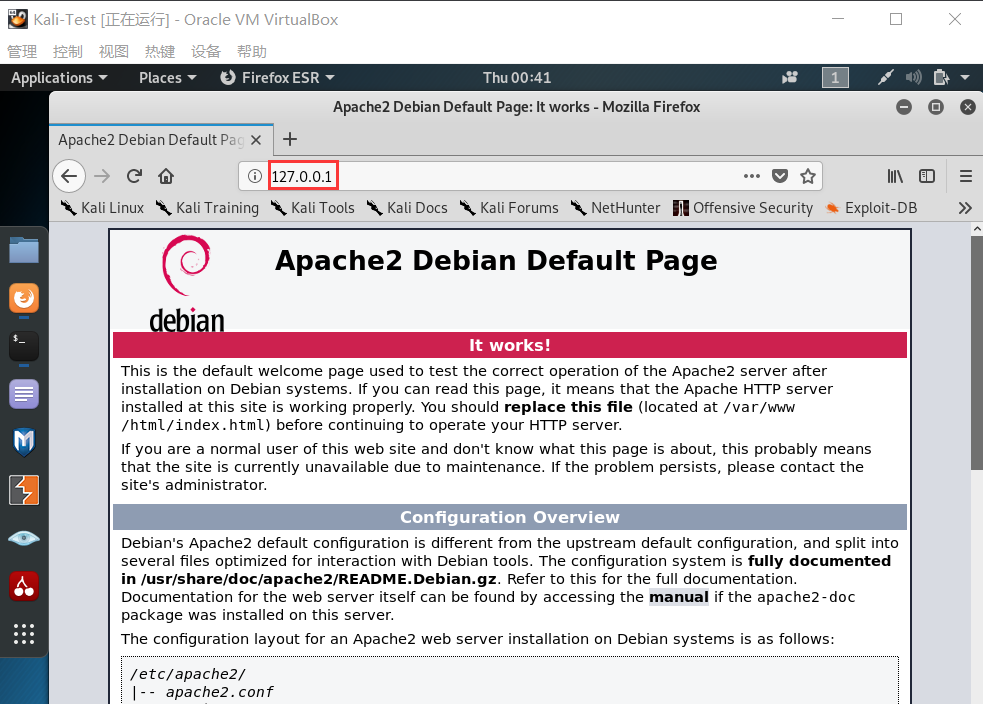
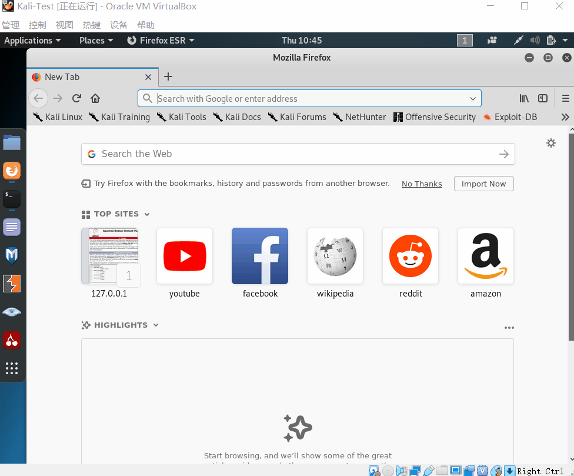

# 静态网页&动态网页实验

## 1 实验要求

1. 安装任何一种webserver，放一种静态的页面在里面，模拟html的加载过程（可以通过抓包观察）
   - 静态html站点的建立
   - 抓包器抓http请求响应的过程
2. 编写动态脚本：用php实现客户端和浏览器的交互，如做一个乘法器，根据用户输入返回结果
   - Apache或nginx建立基本动态的web程序执行的过程
   - 写一个简单的php（可以根据用户的请求动态生成页面）
   - Django框架快速构建web应用

## 2 实验环境

1. VirtualBox下的Kali虚拟机

## 3 实验过程

### 3.1 静态页面

- 启动`apache`服务。
  ```
  /etc/init.d/apache2 start
  # 启动apache服务
  ```
- 通过在网页上输入对应的IP地址`127.0.0.1`，即可呈现`/var/www/html`目录下的`index.html`页面。
  
  
- 编写一个静态页面[`index.html`](index.html)
    ```html
    <!DOCTYPE html>
    <html>
    <head>
    <meta charset="utf-8">
    <title>静态页面</title>
    </head>
    <body>
    <form action="#" method="get">
        <label>用户登录</label><br><br>
        <input type="text" placeholder="请输入用户名" name="username"><br><br>
        <input type="password" placeholder="请输入密码" name="password"><br><br>
        <input type="checkbox">记住我<br><br>
        <button style="width:172px;height:23px;">登录</button>
    </form>
    </body>
    </html>
    ```
- 将自己编写的`index.html`网页放在目录`/var/www/html`下。再次输入IP地址，打开自己的网页。
  ```bash
  scp local_file remote_username@remote_ip:remote_folder 
  # scp index.html root@192.168.83.8:/var/www/html
  ```

  

### 3.2 动态页面

#### 3.2.1 [php代码](phpxssattack.php)实现xss攻击

- 开启apache服务。
- 建立一个php文件命名为`test.php`，放入目录`/var/www`下。通过`127.0.0.1/test.php`访问。
    ```php
    <html>
    <head> 
    <meta http-equiv="Content-Type" content="text/html; charset=utf-8" /> 
    <title>XSS</title> 
    </head> 
    <body> 
    <form action="" method="get"> 
    <input type="text" name="input">     
    <input type="submit"> 
    </form> 
    <br> 
    <?php 
    $XssReflex = $_GET['input'];
    echo 'output:<br>'.$XssReflex;
    ?> 
    </body> 
    </html> 
    ```
    - 一个很简单、也很常见的页面
    - 变量`$XssReflex`获取`get`方式传递的变量名为`input`的变量值（值为一个字符串），然后直接通过`echo()`函数输出，注意这中间并未对用户输入进行任何过滤
    - 用户输入正常的文字，输出正常的文字，若输入js代码`<script>alert('xss attack!!!')</script>`，则会触发xss攻击。
        

#### 3.2.2 [php代码](phpcalculator.php)实现简易计算器


#### 3.2.3 sql注入

## 4 实验总结

- 千万不要选择在windows下搭建，Linux下使用Apache要方便快捷

## 5 参考资料

- [跨站脚本漏洞(XSS)基础讲解](https://www.jianshu.com/p/4fcb4b411a66)
- [PHP实现的简单在线计算器功能示例](https://www.jb51.net/article/120157.htm)