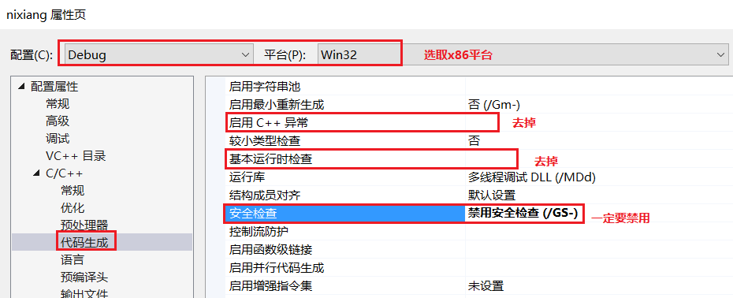
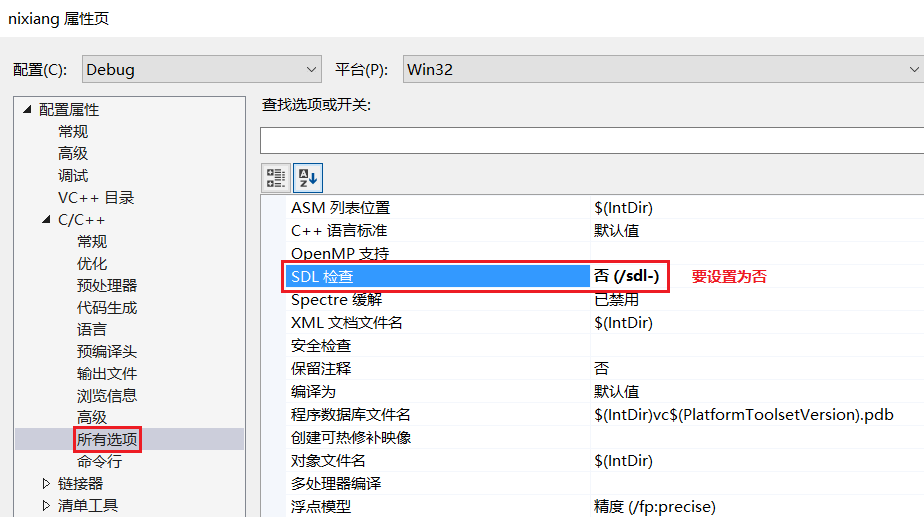
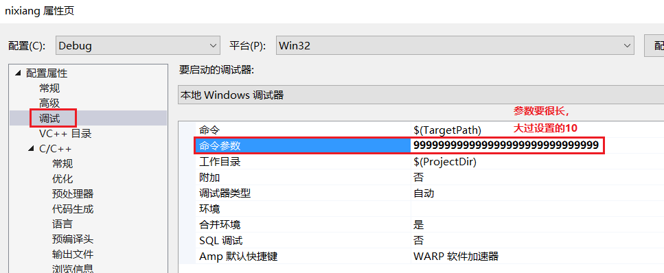
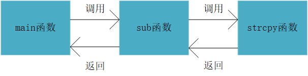
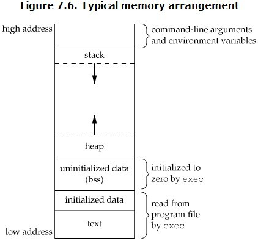

# <center> 缓冲区溢出实验 </center>

##### <center> 赵紫如 </center>

##### <center> 学号：201711123020 班级：2017级信息安全班 </center>

# 1 实验环境

(1) 使用工具：Visual Studio 2019

# 2 实验目的

(1) 观察、测试和分析一段存在缓冲区溢出漏洞的代码；

(2) 分析缓冲区溢出漏洞出现的原因和效果；

(3) 深入理解栈帧，以及相关寄存器的使用。

# 3 实验内容

## 3.1 缓冲区溢出漏洞的代码

(1) 打开vs2019，在一个工程下建立一个.c文件，写入如下代码。由于vs默认建立的是.cpp文件，但是.cpp文件和.c文件的`编译链接方式不同`，所以我们应该建立.c文件或者是将.cpp的后缀名改为.c文件。

```c
#define _CRT_SECURE_NO_WARNINGS

#include <stdlib.h>
#include <stdio.h>
#include <string.h>

int sub(char* x)
{
    char y[10];
    strcpy(y, x);
    return 0;
}

int main(int argc, char** argv)
{
    if (argc > 1)
        sub(argv[1]);
    printf("exit");
}
```

(2) 代码的关键部分解释。

* 主函数中argc代表是命令行参数的个数，argv代表命令行参数的字符数组。通常我们在命令行下运行一个程序会输入的命令格式是`xxx.exe 参数1 参数2`，即argc为3，argv字符数组中argv[0]="xxx.exe"，argv[1]="参数1"，argv[2]="参数2"。
* strcpy函数的用法为`char * strcpy ( char * destination, const char * source );`，它仅将源地址x字符串的指针给目的地址y字符串的指针，即将源地址的数据按顺序写到目的地址，直到源地址的数据读完为止(读到"00"为止)。因为我们分配给y的空间是定值，而x的长度却未知，所以该函数是不安全的，它未考虑字符的长度而直接覆盖，有可能出现用新的数据覆盖了原数据却未进行检查的错误情况。
* 由于strcpy函数的不安全性，在vs2019下是无法编译通过的，所以加上宏定义`#define _CRT_SECURE_NO_WARNINGS`，去除警告和错误，即让编译器认为strcpy是安全的，可以编译通过。
* CRT:C runtime library(part of the C standard library)。运行时库是程序在运行时所需要的库文件，通常以LIB或DLL形式提供。CRT的基本构成是：包含了C语言标准规定的C语言标准库，即C程序运行的最基本和最常用的函数；为应用程序添加启动函数，进行程序的初始化，对全局变量进行赋初值，加载用户程序的入口函数；封装与实现I/O功能；封装与实现堆的功能等。

## 3.2 实验前的准备

### 3.2.1 去除VS2019的一些检查机制

(1) 取消启用C++异常(即取消编译器检测C++异常)、取消基本运行时检查(即不执行基本运行时的错误检查)、禁用安全检查(安全检查可以检测到堆栈缓冲区溢出，所以去掉)。


(2) 取消SDL检查(即取消`安全开发生命周期`建议的其他检查，不启用其它安全代码生成功能并不启用额外的安全相关警告作为错误)。


### 3.2.2 设置过长的命令行参数值

在vs2019的命令行参数下，设置一个超过10位字符的字符，如下。



## 3.3 在调试情况下进行反汇编，观察缓冲区溢出

### 3.3.1 观察栈帧的形成

1. 函数调用及返回关系图。

   

2. 在`strcpy(y,x)`处下断点，进入调试窗口。右键转到反汇编，设置如下选项。选择vs顶栏的`调试->窗口->内存和寄存器`，就可以看到内存窗口和寄存器窗口。
   


3. 栈帧的形成。
   
   (1) 内存地址空间分布。
   * 栈(stack)：堆栈，存放程序的局部变量，在函数被调用时，栈用来传递参数和返回值等，用来保存/恢复调用现场。栈是向下增长。？
   * 堆（heap）：堆是用于存放进程运行中被动态分配(malloc)的内存段，它的大小并不固定，可动态扩张或缩减。堆是向上增长。？
   * BSS段（Block Started by Symbol segment）：通常是指用来存放程序中未初始化的全局变量和静态变量的一块内存区域。BSS段属于静态内存分配。
   * 数据段（data segment）：通常是指用来存放程序中已初始化的全局变量和静态变量的一块内存区域。数据段属于静态内存分配。
   * 代码段（code segment/text segment）：通常是指用来存放程序执行代码的一块内存区域。这部分区域的代码属于只读。在代码段中，字符串常量也属于这部分。
   

   (2) 栈帧：活动记录过程，记录函数调用过程的一些局部变量和中间数据。
   * 同一个程序内的函数的栈帧是连续的，
   * 代码和栈是分开的，每个线程一个栈。
  
   (3) 重点观察寄存器ESP，EBP，EIP等的变化。
   
   * 若平台设置为64位(x64)，则寄存器是RSP，表示64位的寄存器。相当于32位(x86)的寄存器ESP，或者是16位的寄存器SP。


### 3.3.2 缓冲区溢出的发生

