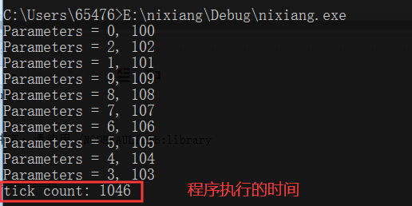
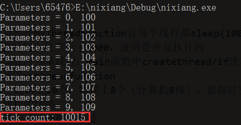
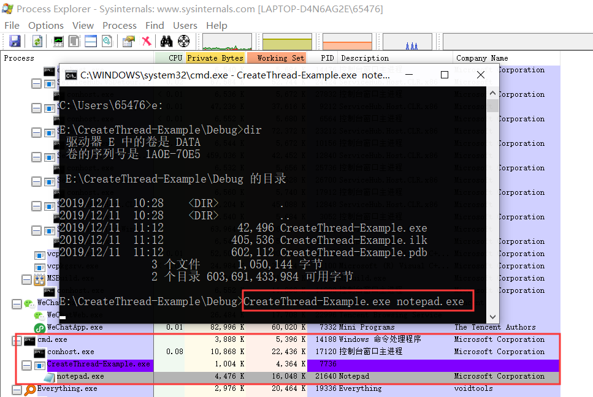

# <center> 多线程与单线程实验 </center>

##### <center> 赵紫如 </center>

##### <center> 学号：201711123020 班级：2017级信息安全班 </center>

## 1 实验环境

(1) Visual Studio 2019

## 2 实验目的

(1) 比较单线程和多线程的区别

## 3 实验过程

(1) 通过查找[MSDN上的CreateThread示例代码](https://docs.microsoft.com/zh-cn/windows/win32/procthread/creating-threads)，在VS2019下运行成功。

* CreatThread的句柄：需要注意的两个参数是
    *  `LPTHREAD_START_ROUTINE`是一个函数指针，制定线程的起点为lpStartAddress。
    *  `__drv_aliasesMem LPVOID`，lpParameter是传递给线程的参数(可类比取快递的快递号)。
  
  ```c++
    HANDLE CreateThread(
    LPSECURITY_ATTRIBUTES   lpThreadAttributes,
    SIZE_T                  dwStackSize,
    LPTHREAD_START_ROUTINE  lpStartAddress,
    __drv_aliasesMem LPVOID lpParameter,
    DWORD                   dwCreationFlags,
    LPDWORD                 lpThreadId
    );
    ```

* 分析CreateThread的示例代码(只选择有用的，删掉无用的)。
  
  * MyThreadFunction函数：Sleep(1000)的目的是让每个线程创建后，先等待1000s后，再进行打印。
    * 优点：扩大程序运行时间，以便查看结果；扩大线程并发执行的随机性，并不是谁先创建谁先被执行完。
  * tmain和main的区别：是main为了支持unicode所使用的main的别名。
  * tmain函数中GetTickCount()，返回从操作系统启动到当前所经过的毫秒数，用程序结束时的毫秒数-程序开始时的毫秒数=程序运行的
    ```c++
    #include <windows.h>
    #include <tchar.h>
    #include <strsafe.h>

    #define MAX_THREADS 10
    #define BUF_SIZE 255

    //创建线程
    DWORD WINAPI MyThreadFunction(LPVOID lpParam);

    // Sample custom data structure for threads to use.
    // This is passed by void pointer so it can be any data type
    // that can be passed using a single void pointer (LPVOID).
    typedef struct MyData {
        int val1;
        int val2;
    } MYDATA, * PMYDATA;

    //主体是for循环
    //参数可以是unicode字符串
    int _tmain()
    {
        PMYDATA pDataArray[MAX_THREADS];
        DWORD   dwThreadIdArray[MAX_THREADS];
        HANDLE  hThreadArray[MAX_THREADS];

        // 开机到现在经历的时间
        // 看程序执行了多久
        DWORD start = GetTickCount();

        // Create MAX_THREADS worker threads.
        // 同时让10个进程运行
        // 虽然执行同一过程，由于并发执行、时间片不同、cpu调度不同，执行完结果不同
        for (int i = 0; i < MAX_THREADS; i++)
        {
            // Allocate memory for thread data.

            pDataArray[i] = (PMYDATA)HeapAlloc(GetProcessHeap(), HEAP_ZERO_MEMORY,
                sizeof(MYDATA));

            if (pDataArray[i] == NULL)
            {
                // If the array allocation fails, the system is out of memory
                // so there is no point in trying to print an error message.
                // Just terminate execution.
                ExitProcess(2);
            }

            // Generate unique data for each thread to work with.

            pDataArray[i]->val1 = i;
            pDataArray[i]->val2 = i + 100;

            // Create the thread to begin execution on its own.

            //pDataArray[i]是MyThreadFunction的参数
            //每个thread有自己独特的id号，由dwThreadIdArray存储
            hThreadArray[i] = CreateThread(
                NULL,                   // default security attributes
                0,                      // use default stack size  
                MyThreadFunction,       // thread function name
                pDataArray[i],          // argument to thread function 
                0,                      // use default creation flags 
                &dwThreadIdArray[i]);   // returns the thread identifier 


            // Check the return value for success.
            // If CreateThread fails, terminate execution. 
            // This will automatically clean up threads and memory. 

            if (hThreadArray[i] == NULL)
            {
                printf("CreateThread Error(%d)", GetLastError());
                ExitProcess(3);
            }
        } // End of main thread creation loop.

        // Wait until all threads have terminated.
        // 等待所有进程运行完毕，若主线程退出，子线程强制退出
        // true 都等到才返回 false 只要有一个结束就返回
        // INFINITY：无限等待
        WaitForMultipleObjects(MAX_THREADS, hThreadArray, TRUE, INFINITE);
        
        DWORD end = GetTickCount();
        printf("tick count: %d\n", end - start);

        // Close all thread handles and free memory allocations.

        for (int i = 0; i < MAX_THREADS; i++)
        {
            CloseHandle(hThreadArray[i]);
            if (pDataArray[i] != NULL)
            {
                HeapFree(GetProcessHeap(), 0, pDataArray[i]);
                pDataArray[i] = NULL;    // Ensure address is not reused.
            }
        }

        return 0;
    }


    DWORD WINAPI MyThreadFunction(LPVOID lpParam)
    {
        PMYDATA pDataArray;
        pDataArray = (PMYDATA)lpParam;
        // 拉长时间，随机性越大
        Sleep(1000);
        printf("Parameters = %d, %d\n",pDataArray->val1, pDataArray->val2);
        return 0;
    }
    ```

(2) 多线程运行的实验结果
  * 实验分析：输出的时间将近1000s，因为虽然每个线程执行前都要先sleep(1000)，但是由于是并行的，所以10个线程同时开始，能够在1000s左右同时完成，甚至较好的时候，输出的时间是1000s。因为**线程切换也需要时间**，所以有时候大于1000s。
    
  
  * 多线程执行后，每个线程执行的顺序不一样，出现**随机性**，虽然大体上是和在创建线程时的顺序上相同。

(3) 改为单线程后的运行效果
  * 线程是`串行`的，时间为所有线程叠加的总时间
    

(4) 创建进程
  * 创建进程的示例代码 [CreateProcess-Example](https://docs.microsoft.com/en-us/windows/win32/procthread/creating-processes)  
    ```c++
    #include <windows.h>
    #include <stdio.h>
    #include <tchar.h>

    void _tmain(int argc, TCHAR* argv[])
    {
        STARTUPINFO si;
        PROCESS_INFORMATION pi;

        ZeroMemory(&si, sizeof(si));
        si.cb = sizeof(si);
        ZeroMemory(&pi, sizeof(pi));

        if (argc != 2)
        {
            printf("Usage: %s [cmdline]\n", argv[0]);
            return;
        }

        // Start the child process. 
        if (!CreateProcess(NULL,   // No module name (use command line)
            argv[1],        // Command line
            NULL,           // Process handle not inheritable
            NULL,           // Thread handle not inheritable
            FALSE,          // Set handle inheritance to FALSE
            0,              // No creation flags
            NULL,           // Use parent's environment block
            NULL,           // Use parent's starting directory 
            &si,            // Pointer to STARTUPINFO structure
            &pi)           // Pointer to PROCESS_INFORMATION structure
            )
        {
            printf("CreateProcess failed (%d).\n", GetLastError());
            return;
        }

        // Wait until child process exits.
        WaitForSingleObject(pi.hProcess, INFINITE);

        // Close process and thread handles. 
        CloseHandle(pi.hProcess);
        CloseHandle(pi.hThread);
    }
    ```
  * 调用过程：首先在vs2019下运行生成exe，找到vs2019生成的exe，在命令行cmd下用该exe创建进程。在此处父进程为`CreateThread-Example.exe`，它创建了子进程`notepad.exe`。用processexplorer查看当前进程的目录树。
    
  * 总结：其他能够创建进程的程序都是调用了`createprocess`函数。假设`xxx.exe`调用`xxx.exe`，再调用`notepad.exe`，当关闭子进程`notepad.exe`时，三个进程都会关闭，因为主函数中写了父进程要等待子进程结束。
    ```c++
    // Wait until child process exits.
        WaitForSingleObject(pi.hProcess, INFINITE);
    ```


## 4 实验总结
1. `E0167	"const char *" 类型的实参与 "LPTSTR" 类型的形参不兼容`	
   解决方法:
   ```c++
   强制类型转换
   ErrorHandler(TEXT("CreatThread"));->ErrorHandler(LPTSTR("CreatThread"));
   ```

## 5 参考资料

* [老师提供的示例代码](threads.cpp) 原为多线程，注释掉第七行的宏定义，即为单线程