# <center> 进程、模块、动态链接库 </center>

## 1 实验环境

1. Visual Studio 2019
   - 工具->命令行->开发者命令提示
        
        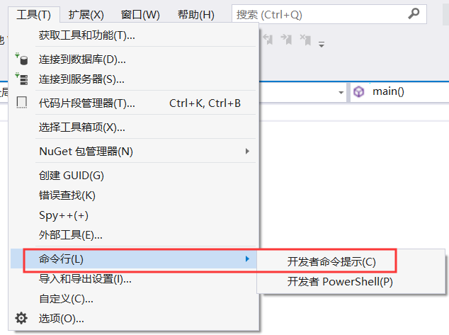

   - cl.exe和link.exe 
   - dumpbin工具

## 2 实验目的

1. 编写dll
   - 把.c文件编译为obj文件
   - 把obj文件和lib文件链接为新的dll和lib文件
   - 注意使用def文件定义导出函数
2. 编写一个exe
   - 调用第1步生成的dll文件中的导出函数
     - 方法一：
       - link时将第1步生成的lib文件作为输入文件
       - 保证dll文件和exe文件在同一个目录，或者dll文件在系统目录
       - 该调用方式称为load time，特点是exe文件导入表中会出先需要调用的dll文件名及函数名，并且在link生成可执行文件exe时，需明确输入lib文件
     - 方法二：
       - 另一种调用方式称为[run time](https://docs.microsoft.com/zh-cn/windows/win32/dlls/using-run-time-dynamic-linking)
       - 使用run time的方式，调用dll的导出函数。包括系统API和第一步自行生成的dll，都要能成功调用
3. 综合使用源代码遍历，结合三个工具`dumpbin`、`process explorer`、`depends`都有查看可执行程序依赖的动态链接库的功能，结果进行结合分析和比较
   - windows sysinternals 工具集
     - process explorer 
   - [depends windows](http://www.dependencywalker.com/)
     - exe调用dll，dll调用exe
     - 某些dll没有调用任何dll，则这个dll是根
     - ntdll.dll：重要的Windows NT内核级文件
     - 看modules的列表

## 3 实验过程

### 3.1 编写dll

#### 3.1.1 回顾编译和链接的基本语句
新建一个空项目，在源文件中添加`a.cpp`和`b.cpp`。
- Visual Studio下的编译链接
    其中`b.cpp`的内容为如下所示，无主函数，但是有一个自己编写的函数，含义为调用一个系统弹框函数。
    ```c
    #include <Windows.h>
    int sub() {
        MessageBox(0,"msg", 0, 0);
        return 0;
    }
    ```
    其中`a.cpp`的内容为如下所示，有主函数，并且调用了`b.cpp`内的sub函数。
    ```c
    int sub();
    int main() {
        sub();
    }
    ```
    由于这两个源文件位于同一个项目中，所以当运行`a.cpp`的时候，Visual Studio会将`a.cpp`和`b.cpp`编译链接成为一个可执行程序，进而`a.cpp`能正常执行sub函数。
    如果没有`b.cpp`，则在运行`a.cpp`的时候会报错`LNK2019`无法解析的外部符号。
- 手工编译链接 
    打开Visual Studio的`开发者命令提示`，切换到含有两个源文件的目录，进行两个文件的编译和链接。
    对于`a.cpp`进行编译，同理`b.cpp`。

    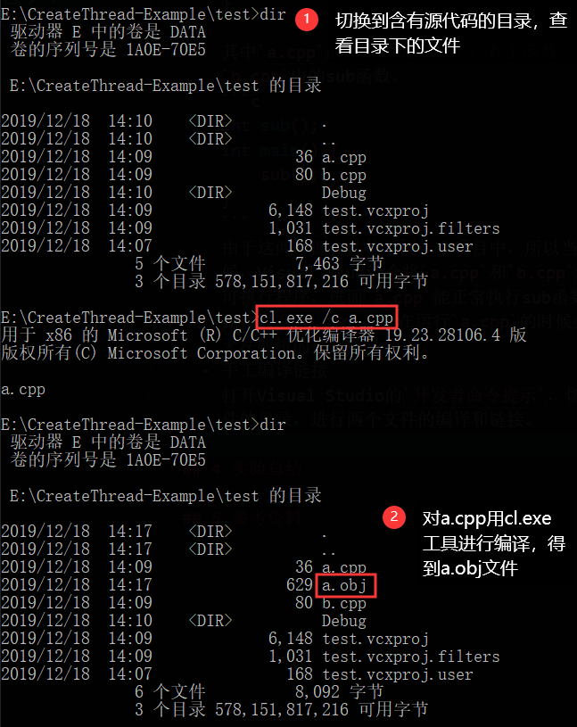

    链接`a.obj`和`b.obj`得到一个可执行文件。

    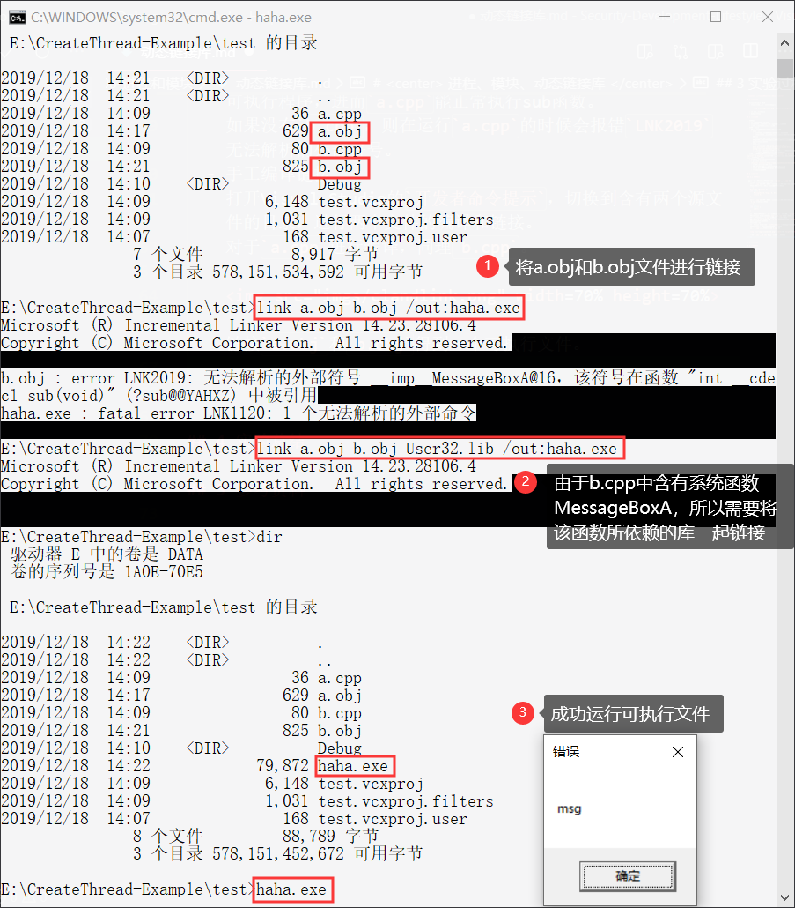

#### 3.1.2 编写dll的步骤

- 在Visual Studio下创建一个新的空项目，添加一个`base.c`文件，包含的内容如下。
    ```c
    #include <Windows.h>
    // 不会被导出的函数
    int intnal_function() {
        return 0;
    }
    // 会被导出的函数
    int lib_function(char* msg) {
        MessageBoxA(0, "msg from base lib", msg, MB_OK);
        return 0;
    }
    ```
- 模块定义文件(.Def：module-definition files)，为链接器提供有关被链接程序的导出、属性及其他方面的信息。
  - 在Visual Studio的项目的源文件下，新建一个def文件名为`exp.def`，其中内容如下所示，其含义是将导出的lib文件命名为`baselib`和只把`lib_function`函数导出。
    ```c
    LIBRARY   baselib
    EXPORTS
        lib_function
    ```
- 手工编写dll
  - 将`base.c`文件编译为`base.obj`文件
    
      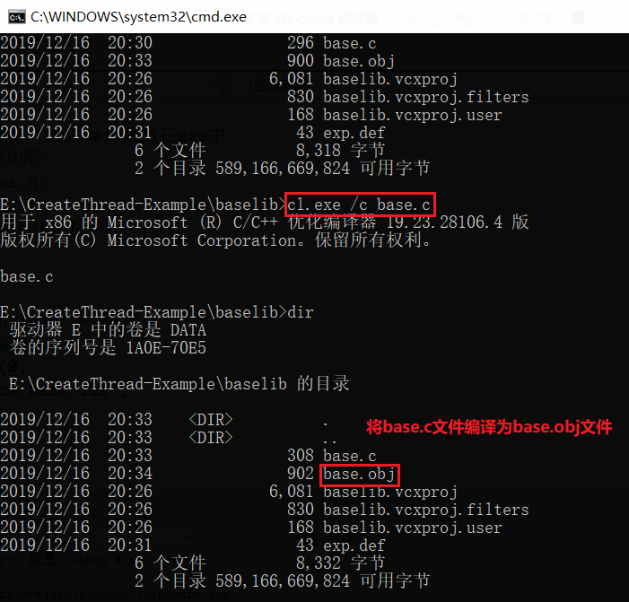

  - 将`base.obj`文件和其他lib文件链接为新的dll和lib文件，其中用到的重要命令为`/dll`和`/def`。
      
      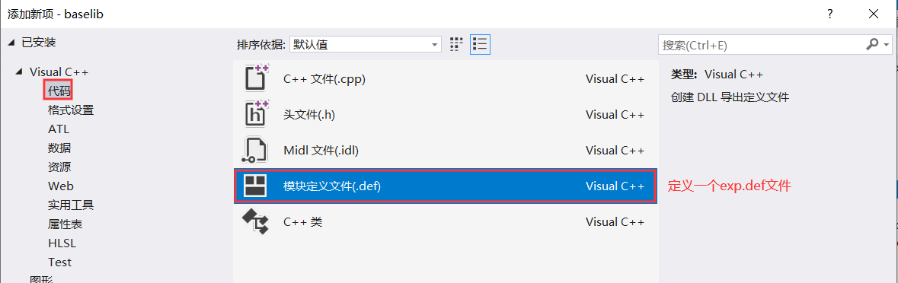

  - 链接的具体命令和过程如下。

    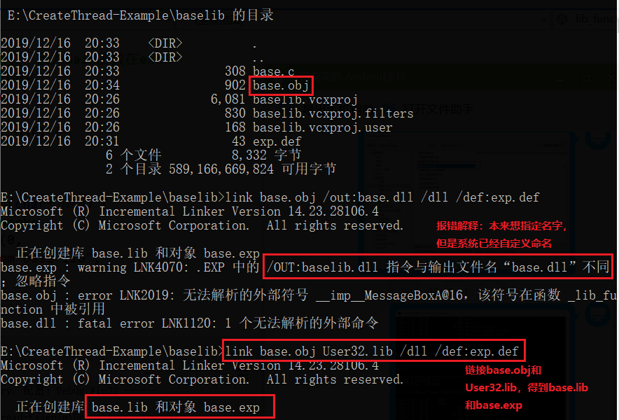

- Visual Studio下编写dll
  - 需要修改`属性页->常规->配置类型->动态库(.dll)`和`属性页->链接器->输入->模块定义文件->设置为exp.def`。
    
    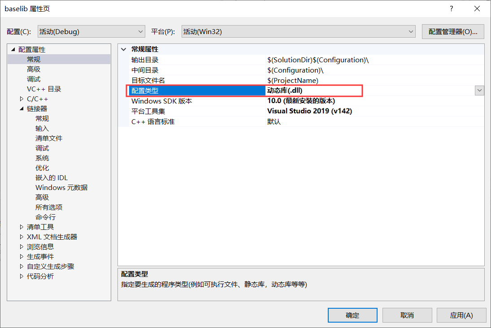

    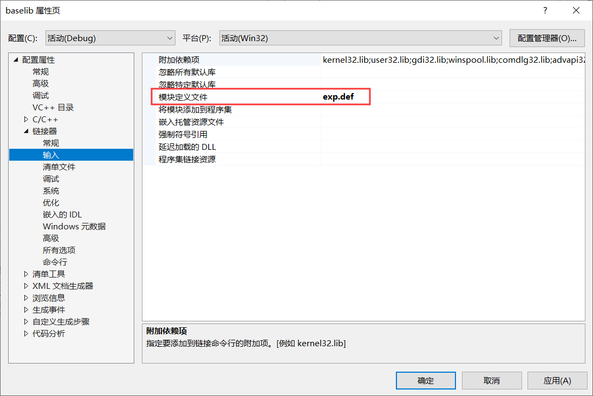

- 查看该dll的导出表，命令为`dumpbin /exports baselib.dll`，发现里面有`lib_function`。
  
    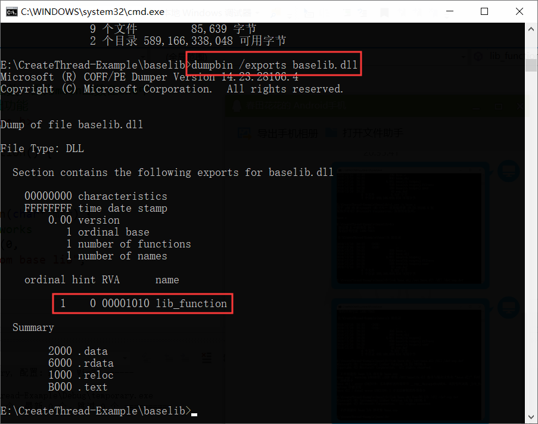

### 3.2 编写一个exe，调用上一步生成的dll文件中的导出函数

#### 3.2.1 load time(载入时)方式

- 在Visual studio下建立一个新的空项目，添加一个源文件为`app.c`。其中内容如下所示，其中头文件是调用了上一步项目的头文件`baselib.h`。
    ```c
    #include "..\baselib\baselib.h"

    int main() {
        lib_function("call a dll");
    }
    ```
    头文件`baselib.h`的内容如下所示。
    ```c
    #pragma once // 为了避免重复引用
    int lib_function(char*);
    ```
- 手工进行调用
  - 先将`app.c`进行编译处理，命令为`cl.exe /c app.c`，生成`app.obj`。
  - 再将`app.obj`和`base.lib`文件进行链接，形成可执行程序。

    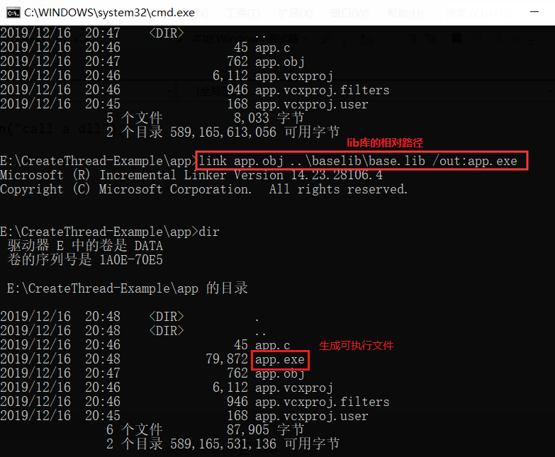
  
  - 若需要运行`app.exe`，还需要将对应的dll文件和该可执行程序位于相同的目录下，或者将dll文件放入系统目录下。

    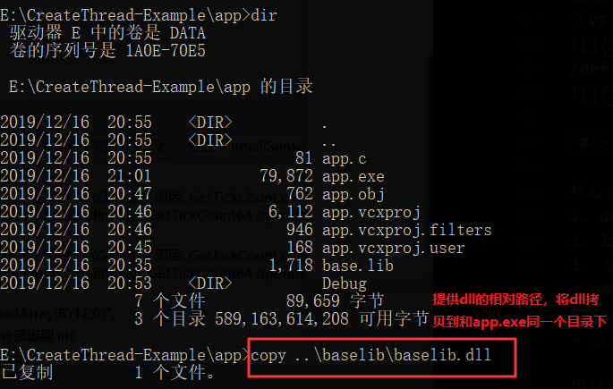

- Visual Studio下进行调用
  - 在解决方案管理面板中添加头文件和资源文件
    - 添加一个现有项头文件，在文件夹中找到第三方库的头文件(baselib.h)，添加进新建立的项目。
    - 添加一个现有项资源文件，在文件夹中找到第三方库的库文件(base.lib)，添加进新建立的项目。

        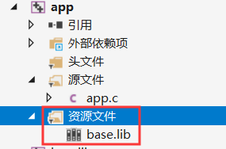
  - 在项目属性设置中添加头文件和库文件
    - `项目->属性->VC++目录->包含目录`中添加第三方库的头文件
    - `库目录`下添加第三方库的库文件(.lib文件）

        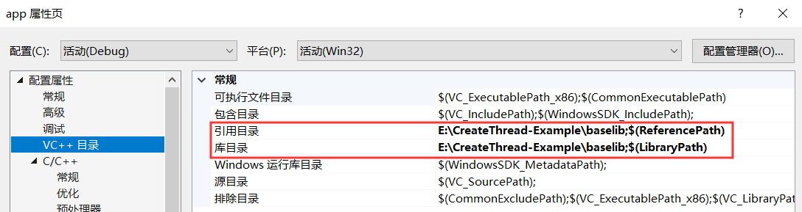

    - `项目->属性->链接器->输入->附加依赖项`中输入库文件名称

        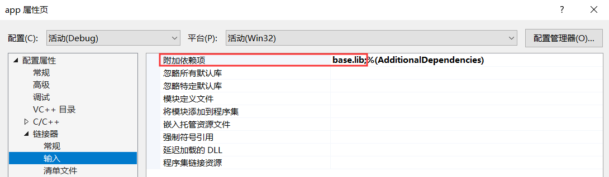


#### 3.2.2 run time(运行时)方式

### 3.3 查看可执行程序动态链接库的功能

- [遍历当前系统中运行的所有进程](https://docs.microsoft.com/zh-cn/windows/win32/toolhelp/taking-a-snapshot-and-viewing-processes)，并且遍历每个进程的模块和线程数量。
  - 用命令行命令`tasklist`同样可以实现相同的功能。
  - 修改示例代码，实现查看当前系统中运行的所有进程，以及只输出`app.exe`的相关模块和线程，结果如下。其中包括`baselib.dll`。[代码见`process.c`](process.c)。
        
    ```bash
    PROCESS ID:0    PROCESS NAME:[System Process]
    PROCESS ID:4    PROCESS NAME:System
    PROCESS ID:96   PROCESS NAME:Registry
    PROCESS ID:400  PROCESS NAME:smss.exe
    PROCESS ID:692  PROCESS NAME:csrss.exe
    PROCESS ID:804  PROCESS NAME:wininit.exe
    PROCESS ID:876  PROCESS NAME:services.exe
    PROCESS ID:892  PROCESS NAME:lsass.exe
    PROCESS ID:1008 PROCESS NAME:svchost.exe
    PROCESS ID:72   PROCESS NAME:svchost.exe
    PROCESS ID:416  PROCESS NAME:WUDFHost.exe
    PROCESS ID:532  PROCESS NAME:fontdrvhost.exe
    PROCESS ID:716  PROCESS NAME:WUDFHost.exe
    PROCESS ID:920  PROCESS NAME:svchost.exe
    PROCESS ID:1068 PROCESS NAME:svchost.exe
    PROCESS ID:1328 PROCESS NAME:svchost.exe
    PROCESS ID:1428 PROCESS NAME:svchost.exe
    PROCESS ID:1436 PROCESS NAME:svchost.exe
    PROCESS ID:1520 PROCESS NAME:svchost.exe
    PROCESS ID:1556 PROCESS NAME:svchost.exe
    PROCESS ID:1576 PROCESS NAME:svchost.exe
    PROCESS ID:1648 PROCESS NAME:svchost.exe
    PROCESS ID:1796 PROCESS NAME:svchost.exe
    PROCESS ID:1804 PROCESS NAME:svchost.exe
    PROCESS ID:1848 PROCESS NAME:svchost.exe
    PROCESS ID:1928 PROCESS NAME:svchost.exe
    PROCESS ID:2032 PROCESS NAME:svchost.exe
    PROCESS ID:2040 PROCESS NAME:atiesrxx.exe
    PROCESS ID:1476 PROCESS NAME:svchost.exe
    PROCESS ID:1740 PROCESS NAME:svchost.exe
    PROCESS ID:2172 PROCESS NAME:svchost.exe
    PROCESS ID:2188 PROCESS NAME:svchost.exe
    PROCESS ID:2368 PROCESS NAME:svchost.exe
    PROCESS ID:2420 PROCESS NAME:svchost.exe
    PROCESS ID:2428 PROCESS NAME:svchost.exe
    PROCESS ID:2448 PROCESS NAME:svchost.exe
    PROCESS ID:2484 PROCESS NAME:svchost.exe
    PROCESS ID:2552 PROCESS NAME:Memory Compression
    PROCESS ID:2612 PROCESS NAME:svchost.exe
    PROCESS ID:2656 PROCESS NAME:svchost.exe
    PROCESS ID:2720 PROCESS NAME:igfxCUIService.exe
    PROCESS ID:2772 PROCESS NAME:svchost.exe
    PROCESS ID:2788 PROCESS NAME:svchost.exe
    PROCESS ID:2896 PROCESS NAME:svchost.exe
    PROCESS ID:2220 PROCESS NAME:svchost.exe
    PROCESS ID:3044 PROCESS NAME:RtkAudioService64.exe
    PROCESS ID:3148 PROCESS NAME:svchost.exe
    PROCESS ID:3156 PROCESS NAME:svchost.exe
    PROCESS ID:3324 PROCESS NAME:svchost.exe
    PROCESS ID:3384 PROCESS NAME:svchost.exe
    PROCESS ID:3500 PROCESS NAME:spoolsv.exe
    PROCESS ID:3508 PROCESS NAME:wlanext.exe
    PROCESS ID:3516 PROCESS NAME:conhost.exe
    PROCESS ID:3604 PROCESS NAME:svchost.exe
    PROCESS ID:3760 PROCESS NAME:CAJSHost.exe
    PROCESS ID:3772 PROCESS NAME:svchost.exe
    PROCESS ID:3780 PROCESS NAME:svchost.exe
    PROCESS ID:3792 PROCESS NAME:svchost.exe
    PROCESS ID:3808 PROCESS NAME:svchost.exe
    PROCESS ID:3816 PROCESS NAME:IntelCpHDCPSvc.exe
    PROCESS ID:3840 PROCESS NAME:AppGoService.exe
    PROCESS ID:3848 PROCESS NAME:svchost.exe
    PROCESS ID:3884 PROCESS NAME:ETDService.exe
    PROCESS ID:3896 PROCESS NAME:OfficeClickToRun.exe
    PROCESS ID:3924 PROCESS NAME:ibtsiva.exe
    PROCESS ID:3948 PROCESS NAME:Lenovo.Modern.ImController.exe
    PROCESS ID:3956 PROCESS NAME:svchost.exe
    PROCESS ID:4044 PROCESS NAME:LenovoPcManagerService.exe
    PROCESS ID:4088 PROCESS NAME:mfemms.exe
    PROCESS ID:2224 PROCESS NAME:svchost.exe
    PROCESS ID:3104 PROCESS NAME:ModuleCoreService.exe
    PROCESS ID:3068 PROCESS NAME:svchost.exe
    PROCESS ID:3536 PROCESS NAME:QQProtect.exe
    PROCESS ID:3520 PROCESS NAME:PEFService.exe
    PROCESS ID:4128 PROCESS NAME:svchost.exe
    PROCESS ID:4140 PROCESS NAME:svchost.exe
    PROCESS ID:4264 PROCESS NAME:svchost.exe
    PROCESS ID:4280 PROCESS NAME:WmiApSrv.exe
    PROCESS ID:4304 PROCESS NAME:svchost.exe
    PROCESS ID:4396 PROCESS NAME:svchost.exe
    PROCESS ID:4424 PROCESS NAME:svchost.exe
    PROCESS ID:4756 PROCESS NAME:jhi_service.exe
    PROCESS ID:4912 PROCESS NAME:svchost.exe
    PROCESS ID:5056 PROCESS NAME:svchost.exe
    PROCESS ID:5112 PROCESS NAME:Locator.exe
    PROCESS ID:5148 PROCESS NAME:IntelCpHeciSvc.exe
    PROCESS ID:5440 PROCESS NAME:MMSSHOST.exe
    PROCESS ID:5504 PROCESS NAME:mfevtps.exe
    PROCESS ID:5600 PROCESS NAME:ProtectedModuleHost.exe
    PROCESS ID:5400 PROCESS NAME:dllhost.exe
    PROCESS ID:6228 PROCESS NAME:svchost.exe
    PROCESS ID:6312 PROCESS NAME:mfefire.exe
    PROCESS ID:6968 PROCESS NAME:svchost.exe
    PROCESS ID:6864 PROCESS NAME:McCSPServiceHost.exe
    PROCESS ID:7560 PROCESS NAME:servicehost.exe
    PROCESS ID:7592 PROCESS NAME:mcapexe.exe
    PROCESS ID:7688 PROCESS NAME:MfeAVSvc.exe
    PROCESS ID:820  PROCESS NAME:mcshield.exe
    PROCESS ID:7128 PROCESS NAME:svchost.exe
    PROCESS ID:1284 PROCESS NAME:svchost.exe
    PROCESS ID:1828 PROCESS NAME:DolbyDAX2API.exe
    PROCESS ID:3872 PROCESS NAME:svchost.exe
    PROCESS ID:4312 PROCESS NAME:GoogleCrashHandler.exe
    PROCESS ID:5584 PROCESS NAME:GoogleCrashHandler64.exe
    PROCESS ID:7632 PROCESS NAME:wsctrl.exe
    PROCESS ID:8100 PROCESS NAME:SgrmBroker.exe
    PROCESS ID:6624 PROCESS NAME:svchost.exe
    PROCESS ID:3008 PROCESS NAME:svchost.exe
    PROCESS ID:700  PROCESS NAME:SearchIndexer.exe
    PROCESS ID:8696 PROCESS NAME:svchost.exe
    PROCESS ID:9028 PROCESS NAME:svchost.exe
    PROCESS ID:8856 PROCESS NAME:PresentationFontCache.exe
    PROCESS ID:9224 PROCESS NAME:svchost.exe
    PROCESS ID:9232 PROCESS NAME:svchost.exe
    PROCESS ID:12052        PROCESS NAME:svchost.exe
    PROCESS ID:12176        PROCESS NAME:svchost.exe
    PROCESS ID:14988        PROCESS NAME:svchost.exe
    PROCESS ID:12752        PROCESS NAME:svchost.exe
    PROCESS ID:12432        PROCESS NAME:svchost.exe
    PROCESS ID:5212 PROCESS NAME:SecurityHealthService.exe
    PROCESS ID:17048        PROCESS NAME:svchost.exe
    PROCESS ID:344  PROCESS NAME:svchost.exe
    PROCESS ID:9400 PROCESS NAME:svchost.exe
    PROCESS ID:20028        PROCESS NAME:svchost.exe
    PROCESS ID:11300        PROCESS NAME:svchost.exe
    PROCESS ID:13124        PROCESS NAME:svchost.exe
    PROCESS ID:116  PROCESS NAME:svchost.exe
    PROCESS ID:16412        PROCESS NAME:svchost.exe
    PROCESS ID:13460        PROCESS NAME:svchost.exe
    PROCESS ID:18588        PROCESS NAME:dasHost.exe
    PROCESS ID:17456        PROCESS NAME:LAVService.exe
    PROCESS ID:18412        PROCESS NAME:LenovoDRS.exe
    PROCESS ID:13216        PROCESS NAME:usysdiag.exe
    PROCESS ID:15924        PROCESS NAME:csrss.exe
    PROCESS ID:9068 PROCESS NAME:winlogon.exe
    PROCESS ID:11876        PROCESS NAME:fontdrvhost.exe
    PROCESS ID:6252 PROCESS NAME:dwm.exe
    PROCESS ID:14304        PROCESS NAME:atieclxx.exe
    PROCESS ID:10116        PROCESS NAME:svchost.exe
    PROCESS ID:22640        PROCESS NAME:uihost.exe
    PROCESS ID:12028        PROCESS NAME:ETDCtrl.exe
    PROCESS ID:20568        PROCESS NAME:RAVBg64.exe
    PROCESS ID:7700 PROCESS NAME:McUICnt.exe
    PROCESS ID:23160        PROCESS NAME:sihost.exe
    PROCESS ID:652  PROCESS NAME:svchost.exe
    PROCESS ID:11376        PROCESS NAME:svchost.exe
    PROCESS ID:22692        PROCESS NAME:svchost.exe
    PROCESS ID:19484        PROCESS NAME:igfxEM.exe
    PROCESS ID:17364        PROCESS NAME:taskhostw.exe
    PROCESS ID:18376        PROCESS NAME:taskhostw.exe
    PROCESS ID:5480 PROCESS NAME:ETDCtrlHelper.exe
    PROCESS ID:4476 PROCESS NAME:SLBrowser.exe
    PROCESS ID:21404        PROCESS NAME:ctfmon.exe
    PROCESS ID:17676        PROCESS NAME:SLBrowser.exe
    PROCESS ID:16724        PROCESS NAME:explorer.exe
    PROCESS ID:13548        PROCESS NAME:ChsIME.exe
    PROCESS ID:20756        PROCESS NAME:RadeonSettings.exe
    PROCESS ID:1480 PROCESS NAME:svchost.exe
    PROCESS ID:18400        PROCESS NAME:svchost.exe
    PROCESS ID:15032        PROCESS NAME:dllhost.exe
    PROCESS ID:12876        PROCESS NAME:ApplicationFrameHost.exe
    PROCESS ID:10828        PROCESS NAME:Microsoft.Notes.exe
    PROCESS ID:4860 PROCESS NAME:RuntimeBroker.exe
    PROCESS ID:22976        PROCESS NAME:StartMenuExperienceHost.exe
    PROCESS ID:13712        PROCESS NAME:RuntimeBroker.exe
    PROCESS ID:4472 PROCESS NAME:SearchUI.exe
    PROCESS ID:5344 PROCESS NAME:RuntimeBroker.exe
    PROCESS ID:16292        PROCESS NAME:SkypeBackgroundHost.exe
    PROCESS ID:21164        PROCESS NAME:RemindersServer.exe
    PROCESS ID:6120 PROCESS NAME:SettingSyncHost.exe
    PROCESS ID:10904        PROCESS NAME:SkypeApp.exe
    PROCESS ID:14280        PROCESS NAME:YourPhone.exe
    PROCESS ID:7440 PROCESS NAME:RuntimeBroker.exe
    PROCESS ID:7192 PROCESS NAME:SLBrowser.exe
    PROCESS ID:10460        PROCESS NAME:RuntimeBroker.exe
    PROCESS ID:17832        PROCESS NAME:LockApp.exe
    PROCESS ID:16784        PROCESS NAME:RuntimeBroker.exe
    PROCESS ID:21016        PROCESS NAME:RuntimeBroker.exe
    PROCESS ID:10500        PROCESS NAME:RAVBg64.exe
    PROCESS ID:22044        PROCESS NAME:utility.exe
    PROCESS ID:11880        PROCESS NAME:RAVCpl64.exe
    PROCESS ID:1988 PROCESS NAME:WindowsInternal.ComposableShell.Experiences.TextInput.InputApp.exe
    PROCESS ID:17452        PROCESS NAME:RAVBg64.exe
    PROCESS ID:18176        PROCESS NAME:ONENOTEM.EXE
    PROCESS ID:7460 PROCESS NAME:LenovoTray.exe
    PROCESS ID:10728        PROCESS NAME:SpeedBall.exe
    PROCESS ID:16928        PROCESS NAME:SkypeBridge.exe
    PROCESS ID:5884 PROCESS NAME:SpeedBall.exe
    PROCESS ID:2812 PROCESS NAME:SpeedBall.exe
    PROCESS ID:6040 PROCESS NAME:ModuleCoreService.exe
    PROCESS ID:13628        PROCESS NAME:conhost.exe
    PROCESS ID:23512        PROCESS NAME:WinStore.App.exe
    PROCESS ID:21876        PROCESS NAME:RuntimeBroker.exe
    PROCESS ID:10164        PROCESS NAME:Calculator.exe
    PROCESS ID:16632        PROCESS NAME:MicrosoftEdge.exe
    PROCESS ID:19840        PROCESS NAME:browser_broker.exe
    PROCESS ID:1128 PROCESS NAME:dllhost.exe
    PROCESS ID:4776 PROCESS NAME:svchost.exe
    PROCESS ID:9764 PROCESS NAME:RuntimeBroker.exe
    PROCESS ID:11168        PROCESS NAME:MicrosoftEdgeCP.exe
    PROCESS ID:16124        PROCESS NAME:MicrosoftEdgeSH.exe
    PROCESS ID:3356 PROCESS NAME:SystemSettings.exe
    PROCESS ID:16920        PROCESS NAME:devenv.exe
    PROCESS ID:3732 PROCESS NAME:PerfWatson2.exe
    PROCESS ID:10772        PROCESS NAME:Microsoft.ServiceHub.Controller.exe
    PROCESS ID:4556 PROCESS NAME:conhost.exe
    PROCESS ID:12808        PROCESS NAME:ServiceHub.VSDetouredHost.exe
    PROCESS ID:13656        PROCESS NAME:conhost.exe
    PROCESS ID:2080 PROCESS NAME:ServiceHub.ThreadedWaitDialog.exe
    PROCESS ID:3648 PROCESS NAME:conhost.exe
    PROCESS ID:18668        PROCESS NAME:VcxprojReader.exe
    PROCESS ID:6036 PROCESS NAME:VcxprojReader.exe
    PROCESS ID:12400        PROCESS NAME:VcxprojReader.exe
    PROCESS ID:8432 PROCESS NAME:conhost.exe
    PROCESS ID:10568        PROCESS NAME:conhost.exe
    PROCESS ID:9980 PROCESS NAME:conhost.exe
    PROCESS ID:14980        PROCESS NAME:vcpkgsrv.exe
    PROCESS ID:16852        PROCESS NAME:ServiceHub.SettingsHost.exe
    PROCESS ID:12420        PROCESS NAME:ServiceHub.IdentityHost.exe
    PROCESS ID:14500        PROCESS NAME:conhost.exe
    PROCESS ID:22292        PROCESS NAME:conhost.exe
    PROCESS ID:4172 PROCESS NAME:ServiceHub.Host.CLR.x86.exe
    PROCESS ID:22128        PROCESS NAME:conhost.exe
    PROCESS ID:1668 PROCESS NAME:Lenovo.Modern.ImController.PluginHost.LenovoCorporation.LenovoSettings_4642shxvsv8s2.exe
    PROCESS ID:10528        PROCESS NAME:Lenovo.Modern.ImController.PluginHost.Device.exe
    PROCESS ID:15940        PROCESS NAME:Lenovo.Modern.ImController.PluginHost.LenovoCorporation.LenovoSettings_4642shxvsv8s2.exe
    PROCESS ID:9804 PROCESS NAME:Lenovo.Modern.ImController.PluginHost.Device.exe
    PROCESS ID:23352        PROCESS NAME:Code.exe
    PROCESS ID:23268        PROCESS NAME:Code.exe
    PROCESS ID:8444 PROCESS NAME:Code.exe
    PROCESS ID:10212        PROCESS NAME:Code.exe
    PROCESS ID:22524        PROCESS NAME:Code.exe
    PROCESS ID:11232        PROCESS NAME:CodeHelper.exe
    PROCESS ID:21612        PROCESS NAME:conhost.exe
    PROCESS ID:17716        PROCESS NAME:Code.exe
    PROCESS ID:22452        PROCESS NAME:chrome.exe
    PROCESS ID:6088 PROCESS NAME:chrome.exe
    PROCESS ID:22856        PROCESS NAME:chrome.exe
    PROCESS ID:5244 PROCESS NAME:chrome.exe
    PROCESS ID:22868        PROCESS NAME:chrome.exe
    PROCESS ID:15484        PROCESS NAME:chrome.exe
    PROCESS ID:22032        PROCESS NAME:chrome.exe
    PROCESS ID:17884        PROCESS NAME:chrome.exe
    PROCESS ID:21728        PROCESS NAME:chrome.exe
    PROCESS ID:20800        PROCESS NAME:cmd.exe
    PROCESS ID:5412 PROCESS NAME:conhost.exe
    PROCESS ID:23468        PROCESS NAME:browserhost.exe
    PROCESS ID:11532        PROCESS NAME:QQ.exe
    PROCESS ID:10172        PROCESS NAME:TXPlatform.exe
    PROCESS ID:18624        PROCESS NAME:WmiPrvSE.exe
    PROCESS ID:20784        PROCESS NAME:chrome.exe
    PROCESS ID:6064 PROCESS NAME:vcpkgsrv.exe
    PROCESS ID:9612 PROCESS NAME:ServiceHub.Host.CLR.x86.exe
    PROCESS ID:11324        PROCESS NAME:conhost.exe
    PROCESS ID:18532        PROCESS NAME:ServiceHub.TestWindowStoreHost.exe
    PROCESS ID:3024 PROCESS NAME:conhost.exe
    PROCESS ID:13544        PROCESS NAME:cmd.exe
    PROCESS ID:10964        PROCESS NAME:conhost.exe
    PROCESS ID:17396        PROCESS NAME:app.exe
    Process ID        = 0x000043F4
    Thread count      = 4
    Parent process ID = 0x000034E8
    Priority base     = 8
    Priority class    = 32

        MODULE NAME:     app.exe
        Executable     = E:\CreateThread-Example\app\app.exe
        Process ID     = 0x000043F4
        Ref count (g)  = 0xFFFF
        Ref count (p)  = 0xFFFF
        Base address   = 0x00910000
        Base size      = 90112

        MODULE NAME:     ntdll.dll
        Executable     = C:\WINDOWS\SYSTEM32\ntdll.dll
        Process ID     = 0x000043F4
        Ref count (g)  = 0xFFFF
        Ref count (p)  = 0xFFFF
        Base address   = 0x77480000
        Base size      = 1679360

        MODULE NAME:     KERNEL32.DLL
        Executable     = C:\WINDOWS\System32\KERNEL32.DLL
        Process ID     = 0x000043F4
        Ref count (g)  = 0xFFFF
        Ref count (p)  = 0xFFFF
        Base address   = 0x77150000
        Base size      = 917504

        MODULE NAME:     KERNELBASE.dll
        Executable     = C:\WINDOWS\System32\KERNELBASE.dll
        Process ID     = 0x000043F4
        Ref count (g)  = 0xFFFF
        Ref count (p)  = 0xFFFF
        Base address   = 0x750C0000
        Base size      = 2080768

        MODULE NAME:     baselib.dll
        Executable     = E:\CreateThread-Example\app\baselib.dll
        Process ID     = 0x000043F4
        Ref count (g)  = 0x0001
        Ref count (p)  = 0x0001
        Base address   = 0x7BEE0000
        Base size      = 86016

        MODULE NAME:     USER32.dll
        Executable     = C:\WINDOWS\System32\USER32.dll
        Process ID     = 0x000043F4
        Ref count (g)  = 0x0002
        Ref count (p)  = 0x0002
        Base address   = 0x75710000
        Base size      = 1667072

        MODULE NAME:     win32u.dll
        Executable     = C:\WINDOWS\System32\win32u.dll
        Process ID     = 0x000043F4
        Ref count (g)  = 0x0001
        Ref count (p)  = 0x0001
        Base address   = 0x75D10000
        Base size      = 94208

        MODULE NAME:     GDI32.dll
        Executable     = C:\WINDOWS\System32\GDI32.dll
        Process ID     = 0x000043F4
        Ref count (g)  = 0x0002
        Ref count (p)  = 0x0002
        Base address   = 0x75F50000
        Base size      = 135168

        MODULE NAME:     gdi32full.dll
        Executable     = C:\WINDOWS\System32\gdi32full.dll
        Process ID     = 0x000043F4
        Ref count (g)  = 0x0002
        Ref count (p)  = 0x0002
        Base address   = 0x75D30000
        Base size      = 1417216

        MODULE NAME:     msvcp_win.dll
        Executable     = C:\WINDOWS\System32\msvcp_win.dll
        Process ID     = 0x000043F4
        Ref count (g)  = 0x0001
        Ref count (p)  = 0x0001
        Base address   = 0x77350000
        Base size      = 507904

        MODULE NAME:     ucrtbase.dll
        Executable     = C:\WINDOWS\System32\ucrtbase.dll
        Process ID     = 0x000043F4
        Ref count (g)  = 0x0002
        Ref count (p)  = 0x0002
        Base address   = 0x74E80000
        Base size      = 1175552

        MODULE NAME:     IMM32.DLL
        Executable     = C:\WINDOWS\System32\IMM32.DLL
        Process ID     = 0x000043F4
        Ref count (g)  = 0x0002
        Ref count (p)  = 0x0002
        Base address   = 0x76730000
        Base size      = 151552

        MODULE NAME:     uxtheme.dll
        Executable     = C:\WINDOWS\system32\uxtheme.dll
        Process ID     = 0x000043F4
        Ref count (g)  = 0x0002
        Ref count (p)  = 0x0002
        Base address   = 0x6D3F0000
        Base size      = 499712

        MODULE NAME:     msvcrt.dll
        Executable     = C:\WINDOWS\System32\msvcrt.dll
        Process ID     = 0x000043F4
        Ref count (g)  = 0x0008
        Ref count (p)  = 0x0008
        Base address   = 0x74C70000
        Base size      = 782336

        MODULE NAME:     combase.dll
        Executable     = C:\WINDOWS\System32\combase.dll
        Process ID     = 0x000043F4
        Ref count (g)  = 0x0008
        Ref count (p)  = 0x0008
        Base address   = 0x752C0000
        Base size      = 2580480

        MODULE NAME:     RPCRT4.dll
        Executable     = C:\WINDOWS\System32\RPCRT4.dll
        Process ID     = 0x000043F4
        Ref count (g)  = 0x000B
        Ref count (p)  = 0x000B
        Base address   = 0x75540000
        Base size      = 765952

        MODULE NAME:     SspiCli.dll
        Executable     = C:\WINDOWS\System32\SspiCli.dll
        Process ID     = 0x000043F4
        Ref count (g)  = 0x000B
        Ref count (p)  = 0x000B
        Base address   = 0x74C50000
        Base size      = 131072

        MODULE NAME:     CRYPTBASE.dll
        Executable     = C:\WINDOWS\System32\CRYPTBASE.dll
        Process ID     = 0x000043F4
        Ref count (g)  = 0x0001
        Ref count (p)  = 0x0001
        Base address   = 0x74C40000
        Base size      = 40960

        MODULE NAME:     bcryptPrimitives.dll
        Executable     = C:\WINDOWS\System32\bcryptPrimitives.dll
        Process ID     = 0x000043F4
        Ref count (g)  = 0xFFFF
        Ref count (p)  = 0xFFFF
        Base address   = 0x76A30000
        Base size      = 389120

        MODULE NAME:     sechost.dll
        Executable     = C:\WINDOWS\System32\sechost.dll
        Process ID     = 0x000043F4
        Ref count (g)  = 0x000B
        Ref count (p)  = 0x000B
        Base address   = 0x76AA0000
        Base size      = 483328

        MODULE NAME:     MSCTF.dll
        Executable     = C:\WINDOWS\System32\MSCTF.dll
        Process ID     = 0x000043F4
        Ref count (g)  = 0x0002
        Ref count (p)  = 0x0002
        Base address   = 0x77230000
        Base size      = 1060864

        MODULE NAME:     OLEAUT32.dll
        Executable     = C:\WINDOWS\System32\OLEAUT32.dll
        Process ID     = 0x000043F4
        Ref count (g)  = 0x0001
        Ref count (p)  = 0x0001
        Base address   = 0x773D0000
        Base size      = 598016

        MODULE NAME:     ADVAPI32.dll
        Executable     = C:\WINDOWS\System32\ADVAPI32.dll
        Process ID     = 0x000043F4
        Ref count (g)  = 0x0002
        Ref count (p)  = 0x0002
        Base address   = 0x74FF0000
        Base size      = 495616

        MODULE NAME:     kernel.appcore.dll
        Executable     = C:\WINDOWS\System32\kernel.appcore.dll
        Process ID     = 0x000043F4
        Ref count (g)  = 0x0002
        Ref count (p)  = 0x0002
        Base address   = 0x750B0000
        Base size      = 61440

        MODULE NAME:     TextInputFramework.dll
        Executable     = C:\WINDOWS\System32\TextInputFramework.dll
        Process ID     = 0x000043F4
        Ref count (g)  = 0x0001
        Ref count (p)  = 0x0001
        Base address   = 0x67100000
        Base size      = 540672

        MODULE NAME:     CoreUIComponents.dll
        Executable     = C:\WINDOWS\System32\CoreUIComponents.dll
        Process ID     = 0x000043F4
        Ref count (g)  = 0x0001
        Ref count (p)  = 0x0001
        Base address   = 0x61E30000
        Base size      = 2482176

        MODULE NAME:     CoreMessaging.dll
        Executable     = C:\WINDOWS\System32\CoreMessaging.dll
        Process ID     = 0x000043F4
        Ref count (g)  = 0x0002
        Ref count (p)  = 0x0002
        Base address   = 0x62940000
        Base size      = 561152

        MODULE NAME:     SHCORE.dll
        Executable     = C:\WINDOWS\System32\SHCORE.dll
        Process ID     = 0x000043F4
        Ref count (g)  = 0x0001
        Ref count (p)  = 0x0001
        Base address   = 0x76010000
        Base size      = 540672

        MODULE NAME:     ntmarta.dll
        Executable     = C:\WINDOWS\SYSTEM32\ntmarta.dll
        Process ID     = 0x000043F4
        Ref count (g)  = 0x0001
        Ref count (p)  = 0x0001
        Base address   = 0x6EBA0000
        Base size      = 167936

        MODULE NAME:     wintypes.dll
        Executable     = C:\WINDOWS\SYSTEM32\wintypes.dll
        Process ID     = 0x000043F4
        Ref count (g)  = 0x0001
        Ref count (p)  = 0x0001
        Base address   = 0x685D0000
        Base size      = 892928

        THREAD ID      = 0x000049B4
        Base priority  = 8
        Delta priority = 0


        THREAD ID      = 0x000045C4
        Base priority  = 8
        Delta priority = 0


        THREAD ID      = 0x00002E78
        Base priority  = 8
        Delta priority = 0


        THREAD ID      = 0x00004C9C
        Base priority  = 8
        Delta priority = 0

    PROCESS ID:21676        PROCESS NAME:SLBService.exe
    PROCESS ID:20824        PROCESS NAME:mspdbsrv.exe
    PROCESS ID:10580        PROCESS NAME:MSBuild.exe
    PROCESS ID:16396        PROCESS NAME:conhost.exe
    PROCESS ID:16084        PROCESS NAME:Lsf.exe
    PROCESS ID:15108        PROCESS NAME:chrome.exe
    PROCESS ID:16948        PROCESS NAME:chrome.exe
    PROCESS ID:17036        PROCESS NAME:WmiPrvSE.exe
    PROCESS ID:12508        PROCESS NAME:Code.exe
    PROCESS ID:12824        PROCESS NAME:chrome.exe
    PROCESS ID:18152        PROCESS NAME:chrome.exe
    PROCESS ID:8308 PROCESS NAME:svchost.exe
    PROCESS ID:14232        PROCESS NAME:chrome.exe
    PROCESS ID:16308        PROCESS NAME:vctip.exe
    PROCESS ID:9628 PROCESS NAME:VsDebugConsole.exe
    PROCESS ID:19320        PROCESS NAME:conhost.exe
    PROCESS ID:15000        PROCESS NAME:Process.exe
    ```

- `dumpbin`查看可执行程序`app.exe`。调用了`baselib.dll`和`kernel32.dll`。
    ```bash
    E:\CreateThread-Example\app>dumpbin /imports app.exe
    Microsoft (R) COFF/PE Dumper Version 14.23.28106.4
    Copyright (C) Microsoft Corporation.  All rights reserved.


    Dump of file app.exe

    File Type: EXECUTABLE IMAGE

    Section contains the following imports:

        baselib.dll
                    40D108 Import Address Table
                    412468 Import Name Table
                        0 time date stamp
                        0 Index of first forwarder reference

                        0 lib_function

        KERNEL32.dll
                    40D000 Import Address Table
                    412360 Import Name Table
                        0 time date stamp
                        0 Index of first forwarder reference

                    611 WriteConsoleW
                    44D QueryPerformanceCounter
                    218 GetCurrentProcessId
                    21C GetCurrentThreadId
                    2E9 GetSystemTimeAsFileTime
                    363 InitializeSListHead
                    37F IsDebuggerPresent
                    5AD UnhandledExceptionFilter
                    56D SetUnhandledExceptionFilter
                    2D0 GetStartupInfoW
                    386 IsProcessorFeaturePresent
                    278 GetModuleHandleW
                    217 GetCurrentProcess
                    58C TerminateProcess
                    86 CloseHandle
                    4D3 RtlUnwind
                    261 GetLastError
                    532 SetLastError
                    131 EnterCriticalSection
                    3BD LeaveCriticalSection
                    110 DeleteCriticalSection
                    35F InitializeCriticalSectionAndSpinCount
                    59E TlsAlloc
                    5A0 TlsGetValue
                    5A1 TlsSetValue
                    59F TlsFree
                    1AB FreeLibrary
                    2AE GetProcAddress
                    3C3 LoadLibraryExW
                    462 RaiseException
                    2D2 GetStdHandle
                    612 WriteFile
                    274 GetModuleFileNameW
                    15E ExitProcess
                    277 GetModuleHandleExW
                    1D6 GetCommandLineA
                    1D7 GetCommandLineW
                    109 DecodePointer
                    345 HeapAlloc
                    349 HeapFree
                    175 FindClose
                    17B FindFirstFileExW
                    18C FindNextFileW
                    38B IsValidCodePage
                    1B2 GetACP
                    297 GetOEMCP
                    1C1 GetCPInfo
                    3EF MultiByteToWideChar
                    5FE WideCharToMultiByte
                    237 GetEnvironmentStringsW
                    1AA FreeEnvironmentStringsW
                    514 SetEnvironmentVariableW
                    54A SetStdHandle
                    24E GetFileType
                    2D7 GetStringTypeW
                    9B CompareStringW
                    3B1 LCMapStringW
                    2B4 GetProcessHeap
                    34E HeapSize
                    34C HeapReAlloc
                    19F FlushFileBuffers
                    1EA GetConsoleCP
                    1FC GetConsoleMode
                    523 SetFilePointerEx
                    CB CreateFileW

    Summary

            2000 .data
            6000 .rdata
            1000 .reloc
            C000 .text
    ```
- `process explorer`查看可执行程序`app.exe`。在`View->Lower Pane View->勾选DLLs`。

    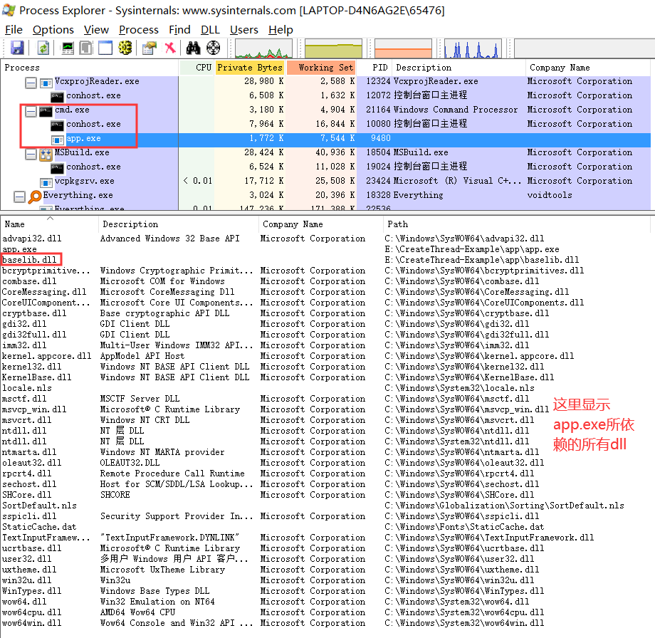

- `depends`查看可执行程序`app.exe`。

    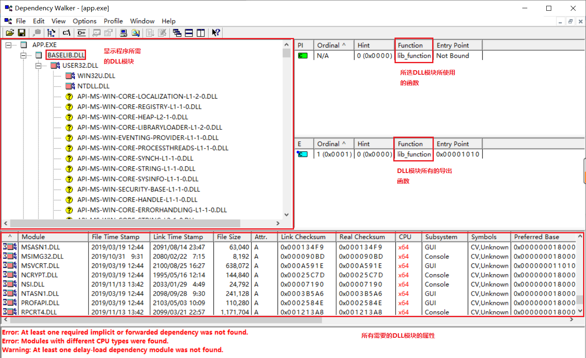

- 三者的分析

## 4 实验总结

## 5 参考资料
