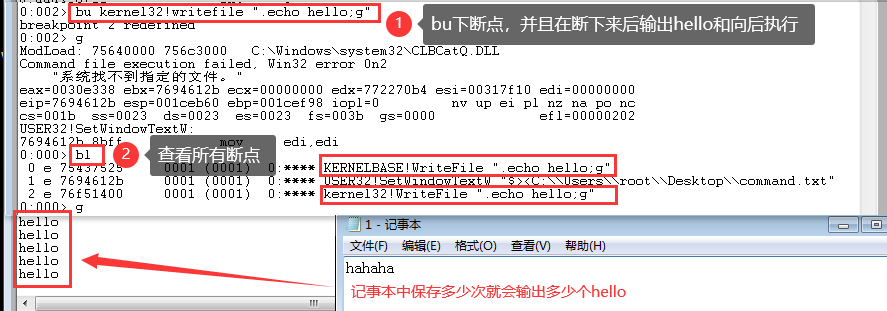
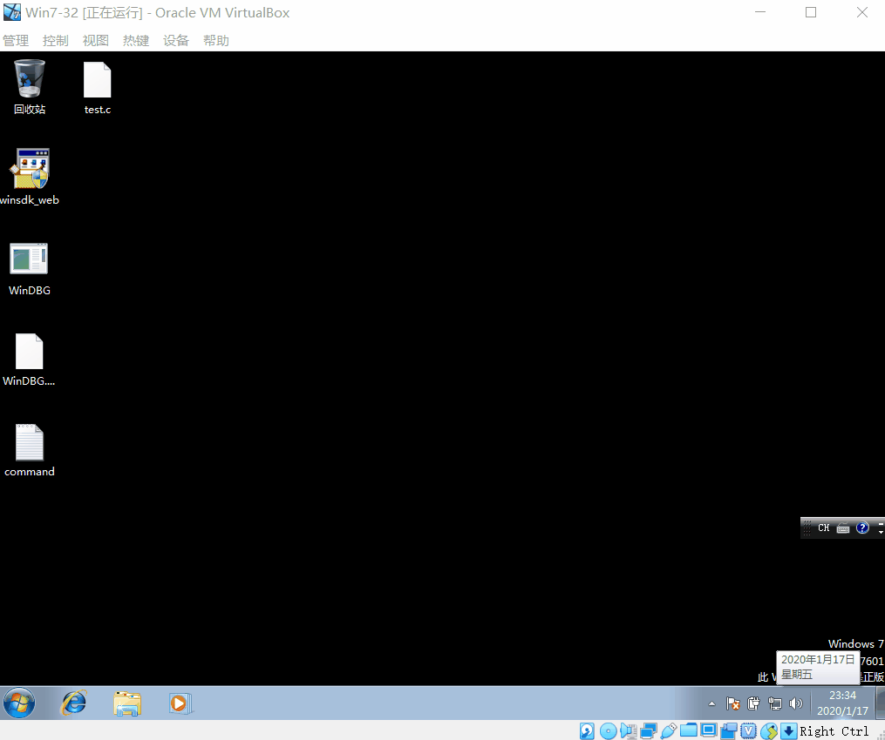

# WinDBG脚本

## 1 实验环境

1. VirtualBox 32位 Windows 7
2. Win 7可用的WinDBG

## 2 实验目的

1. 熟悉WinDBG的使用和一些常用命令。
2. 请修改 32 位 Windows 7 下的计算器的显示过程，使得当你输入的内容是特定数字如 "999" 的时候通过调试器脚本自动改为 "666"。

## 3 实验过程

### 3.1 WinDBG的安装

- 下载 Windows 7 可用的 WinDBG
  - WinDBG 早年是一个单独的工具，后来被包含到了 Windows SDK 中并且不再提供单独下载，根据官方文档你需要下载 Windows SDK 的 ISO 镜像并选择**仅安装 WinDBG**。
  - [Windows 7 SDK 在线安装程序](https://www.microsoft.com/en-us/download/details.aspx?id=8279)，在主机下载后，通过共享文件夹从主机共享到虚拟机，在虚拟机安装(一直下一步就行)，成功安装的截图如下。
    
    

### 3.2 WinDBG的基本使用

- 调试时所需：**源代码**和**符号文件(pdb文件)**
- 32位 win7 离线符号表
- 打开可执行文件`File -> Open Executable`(出现int3后，表示已经打开完成)，在`file->Symbol search path`选择符号文件所在的文件夹(不要直接选择符号文件)
  - 在vs2019下编写`hello world`的.c文件，生成exe后放入win7 虚拟机
  - 将同目录下的pdb也放入win7虚拟机
    
- 选择`attach to a Process`，即可看到本机所有的进程信息，选择要调试的进程。
- 安装windows符号文件`.pdb`文件 使用Windows符号表服务器
- 指令集
  
    |指令|作用|
    |----|----|
    |.symfix|指定本地缓存目录|
    |.sympath|设置符号路径，包括本地缓存和远程符号服务器|
    |.reload|重新加载模板|
    |x|查看模块符号|
    |bu|下断点|
    |bl|列出断点|
    |bc *|清除所有断点/某个序号的断点|
    |g|继续执行程序|
    |k|查看调用堆栈|
    |lm|列出当前进程加载的模块|

### 3.3 WinDBG脚本实验

- **脚本**：一系列的调试命令组合而成的文本文件
- **调试脚本**：用户实现自动化的调试和修改程序执行流程
  
  |命令| 文件名包含分号 | 其他命令相连	| 缩短命令为一行 |允许传递参数|
  |--- | ------------ | ----------- | ------------- | --------- | 
  |$<  | 是 | 否 | 否 | 否 |
  |$>< | 是	| 否 | 是 | 否 |
  |$$< |否	| 是 | 否 | 否 |
  |$$><	|否	| 是 | 是 | 否 |
  |$$>a< | 否 |	是 | 是 | 是 |

  ```
  < 保留原有格式
  >< 指令变成一行 换行符用;替代
  ```

#### 3.3.1 修改记事本

- 在WinDBG的命令输入窗口输入下面的脚本命令，即每次保存后都会打印出`hello`。
  ```bash
  bu kernel32!writefile ".echo hello;g"
  # 我用这个命令成功 说明32位 win7下notepad调用的是kernel32.dll下的WriteFile
  # 大小写不敏感

  # 有的notepad调用的是KERNELBASE.dll下的WriteFile
  bu kernelbase!writefile ".echo hello;g" 
  ```
  
  

  

  - 将上述命令修改为脚本文件，并且调用，能够得到相同结果。
    ```bash
    # 脚本文件
    .echo hello
    g
    # 调用方法
    bu kernelbase!writefile "$><脚本文件的路径"
    # 注意路径需要\\
    ```

- 在win7 虚拟机的桌面新建`command.txt`，内容如下：
    ```
    as /mu content poi(esp+0n12)
    .block{.if($scmp("${content}","123456")==0){ezu poi(esp+0n12) "hacked";}.else{.echo content}}
    g

    # 以下为相关解释
    esp+0n12：记事本写入信息的起始位置
    poi用于获取地址中的内容
    as 用于起别名
    /ma 将别名的等价值设置为从地址Address开始的null结尾的ASCII字符串
    /mu 将别名的等价值设置为从地址Address开始的null结尾的Unicode字符串
    ea 地址 "abc" 表示在地址写入Ascii字符串abc 不包含结束符0
    eza 地址 "abc" 表示在地址写入Ascii字符串abc 包含结束符0
    eu 地址 "abc" 表示在地址写入Unicode字符串abc 不包含结束符0
    ezu 地址 "abc" 表示在地址写入Unicode字符串abc 包含结束符0

    block 将该代码块放在一起content才能正确执行
    ```
    - 通过键入命令触发
        ```bash
        bu kernelbase!writefile "$$><C:\\Users\\zizi\\Desktop\\command.txt"
        ```
    - 验证地址为`esp+0n12`的方法
      - Writefile的参数为
        ```bash
        BOOL WriteFile(
            HANDLE       hFile,
            LPCVOID      lpBuffer,
            DWORD        nNumberOfBytesToWrite,
            LPDWORD      lpNumberOfBytesWritten,
            LPOVERLAPPED lpOverlapped
        );
        ```
      - 栈帧的形成
      - 下断点(无需引入外部脚本文件)，验证
        ```bash
        dd 地址
        查看该地址上的内容
        此处获得的是lpBuffer指针，所以还要dd该指针
        
        poi(地址)
        ```

#### 3.3.2 修改计算器

- 在win7 虚拟机的桌面新建`command.txt`，内容如下：
    ```
    as /mu content poi(esp+8)
    .block{.if($scmp("${content}","999")==0){ezu poi(esp+8) "666";}.else{.echo content}}
    g
    ```

## 4 实验总结 

1. 安装WinDBG的问题
   原因是使用了不同版本的Windows SDK(Soft Development Kit)，包含了开发该Windows版本所需的开发该windows版本所需的windows函数和常数定义、API函数说明文档、相关工具和示例。
   
   

2. [ 未解决 ] 符号表载入出错
   
   


## 5 参考文档

- [小天使的代课教材](https://anjingcuc.github.io/courses-wiki/substitute/windbg-script/)
- [Windows SDK 和模拟器存档](https://developer.microsoft.com/zh-cn/windows/downloads/sdk-archive)
