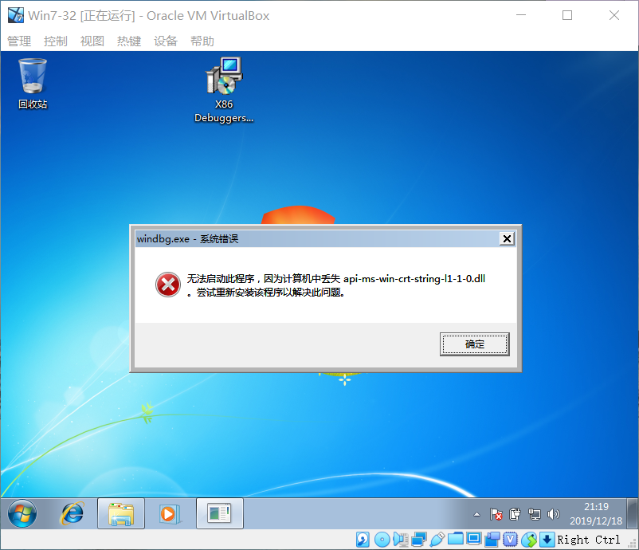

# 
 WinDBG脚本 

## 1 实验环境

1. VirtualBox 32位 Windows 7
2. Win 7可用的WinDBG

## 2 实验目的

1. 熟悉WinDBG的使用和一些常用命令。
2. 请修改 32 位 Windows 7 下的计算器的显示过程，使得当你输入的内容是特定数字如 "999" 的时候通过调试器脚本自动改为 "666"。

## 3 实验过程

## 4 实验总结 

1. 安装WinDBG的问题
   原因是使用了不同版本的Windows SDK(Soft Development Kit)，包含了开发该Windows版本所需的开发该windows版本所需的windows函数和常数定义、API函数说明文档、相关工具和示例。
   

## 5 参考文档

* [小天使的代课教材](https://anjingcuc.github.io/courses-wiki/substitute/windbg-script/)