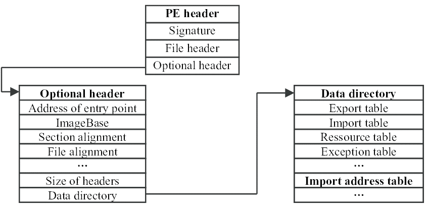
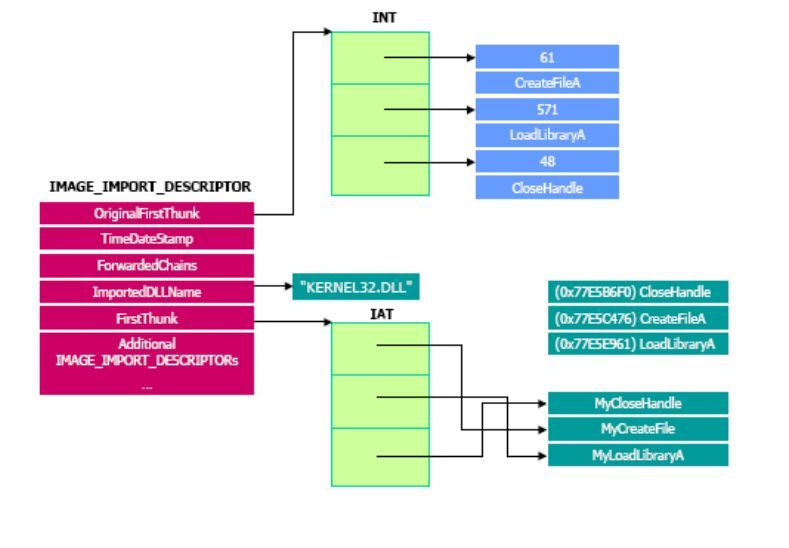
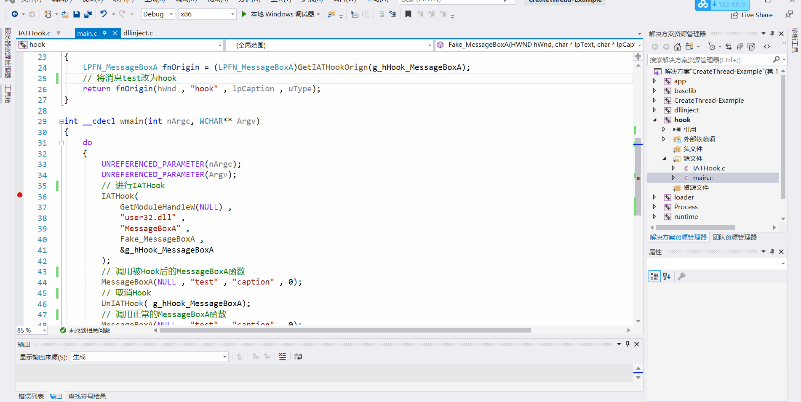
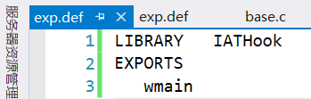
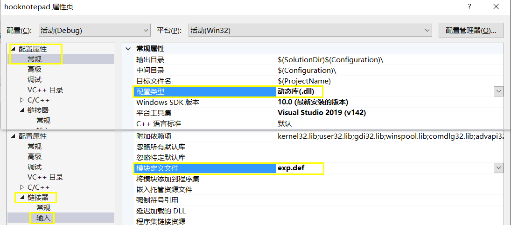

# 线程注入技术 + IAT HOOK

## 1 实验要求

**线程注入技术和IAT HOOK综合运用，实现对系统中进程的修改**。以**API hook**的方式进行，选下列任务其一完成
- 「 hook notepad writefile 」实现向notepad中写入`haha`保存后，再打开显示`hehe`。
  - 注意：hook writefile之前要先调用createfile。
  - 把writefile的功能，写成dll，把这个dll注入到notepad的进程中，远程线程注入。
- 「 FindFirstFile & FindNextFile 」实现文件或者程序的隐藏，无法通过dir遍历该文件或者程序。
  - 即把dll注入到cmd，输入dir获取文件目录时，若出现自己想要隐藏的文件或者程序，就把这些程序不显示。
- 「 修改遍历进程的方法 」`taskmanager/tasklist`无法遍历某个进程
- 「 hook textout、setwindowtext等函数 」可以记录输出，如屏幕取词(金山词霸、有道词典)
- 「 接管其他进程的键盘输入 」
  - 读取微信进程的文本框输入

## 2 实验环境

- Visual Studio 2019 
  - 选择`Debug x86`
- 选择32位 Notepad ，位于路径`C:\Windows\SysWOW64`
  - ~不要被名字迷惑~
  - 64位 Notepad 位于路径`C:\Windows\System32`

## 3 实验原理

- **HOOK**：包含一系列的技术，用于通过拦截软件组件之间传递的函数调用或消息或事件来改变或增强操作系统，应用程序或其他软件组件的行为。处理此类截获的函数调用，事件或消息的代码称为**钩子**。
- **API HOOK**：给API函数挂钩，修改函数的地址，将本应该调用的API函数拦截，使其转而调用我们自己的函数，从而达到篡改程序行为的目的。基于`Windows`的操作系统上执行`API Hook`的方法如下：
  - 虚拟功能绕行
  - 虚函数指针交换
  - 虚拟表指针交换
  - 导入地址表(IAT)
  - VEH 向量化异常处理(windows的异常处理机制)
- **IAT HOOK**：操纵导入地址表将API函数重定向到所需的存储器地址(可以是另一个API函数，恶意的shellcode或程序代码的另一部分)
  - 在进程内存中查找IAT表的地址。
    
    
  - 知道哪一个是要被Hook的API函数，将该API函数地址进行替换。
    - 导入地址表中的地址顺序与导入名称表(INT)相同，通过解析INT表，可以找到所需API函数的索引号。
    
    

## 4 实验过程

参考[IAT HOOK的github开源项目](https://github.com/tinysec/iathook)

### 4.1 Fake MessageBox

- 在vs2019下的某个解决方案下建立`hook`工程，新建[`main.c`主函数所在的文件](messageboxmain.c)，内容如下。
    ```c
    #include <Windows.h>

    LONG IATHook
    (
        __in void* pImageBase ,
        __in_opt char* pszImportDllName ,
        __in char* pszRoutineName ,
        __in void* pFakeRoutine ,
        __out HANDLE* Param_phHook
    );

    LONG UnIATHook( __in HANDLE hHook );

    void* GetIATHookOrign( __in HANDLE hHook );

    typedef int (__stdcall *LPFN_MessageBoxA)( __in_opt HWND hWnd , __in_opt char* lpText , __in_opt char* lpCaption , __in UINT uType);

    HANDLE g_hHook_MessageBoxA = NULL;
    //////////////////////////////////////////////////////////////////////////

    // 调用fake messagebox
    int __stdcall Fake_MessageBoxA( __in_opt HWND hWnd , __in_opt char* lpText , __in_opt char* lpCaption , __in UINT uType)
    {
        LPFN_MessageBoxA fnOrigin = (LPFN_MessageBoxA)GetIATHookOrign(g_hHook_MessageBoxA);
        // 将消息test改为hook
        return fnOrigin(hWnd , "hook" , lpCaption , uType);
    }

    int __cdecl wmain(int nArgc, WCHAR** Argv)
    {
        do 
        {
            UNREFERENCED_PARAMETER(nArgc);
            UNREFERENCED_PARAMETER(Argv);
            // 进行IATHook
            IATHook(
                GetModuleHandleW(NULL) ,
                "user32.dll" , 
                "MessageBoxA" ,
                Fake_MessageBoxA ,
                &g_hHook_MessageBoxA
            );
            // 调用被Hook后的MessageBoxA函数
            MessageBoxA(NULL , "test" , "caption" , 0);
            // 取消Hook
            UnIATHook( g_hHook_MessageBoxA);
            // 调用正常的MessageBoxA函数
            MessageBoxA(NULL , "test" , "caption" , 0);
        
        } while (FALSE);
        
        return 0;
    }
    ```
- 在同目录下添加[`IATHook.c`文件](IATHook.c)，实现`main.c`中各个函数。
    ```c
    // windows IATHook for kernelmode and usermode 
    // by TinySec( root@tinysec.net )
    // you can free use this code , but if you had modify , send a copy to to my email please.


    /*
    LONG IATHook
    (
        __in void* pImageBase ,
        __in_opt char* pszImportDllName ,
        __in char* pszRoutineName ,
        __in void* pFakeRoutine ,
        __out HANDLE* Param_phHook
    );

    LONG UnIATHook( __in HANDLE hHook );

    void* GetIATHookOrign( __in HANDLE hHook );
    */


    //////////////////////////////////////////////////////////////////////////

    #ifdef _RING0
        #include <ntddk.h>
        #include <ntimage.h>
    #else
        #include <windows.h>
        #include <stdlib.h>
    #endif //#ifdef _RING0


    //////////////////////////////////////////////////////////////////////////

    typedef struct _IATHOOK_BLOCK
    {
        void*	pOrigin;

        void*	pImageBase;
        char*	pszImportDllName;
        char*	pszRoutineName;

        void*	pFake;
        
    }IATHOOK_BLOCK;


    //////////////////////////////////////////////////////////////////////////

    void* _IATHook_Alloc(__in ULONG nNeedSize)
    {
        void* pMemory = NULL;

        do 
        {
            if ( 0 == nNeedSize )
            {
                break;
            }
            
    #ifdef _RING0
            pMemory = ExAllocatePoolWithTag( NonPagedPool , nNeedSize , 'iath' );

    #else
            pMemory = malloc( nNeedSize );
    #endif // #ifdef _RING0
            
            if ( NULL == pMemory )
            {
                break;
            }

            RtlZeroMemory( pMemory , nNeedSize );

        } while (FALSE);

        return pMemory;
    }


    ULONG _IATHook_Free(__in void* pMemory )
    {

        do 
        {
            if ( NULL == pMemory )
            {
                break;
            }
            
    #ifdef _RING0
            ExFreePool( pMemory );
            
    #else
            free( pMemory );
    #endif // #ifdef _RING0
            
            pMemory = NULL;
            
        } while (FALSE);
        
        return 0;
    }

    //////////////////////////////////////////////////////////////////////////
    #ifdef _RING0


    #ifndef LOWORD
        #define LOWORD(l)           ((USHORT)((ULONG_PTR)(l) & 0xffff))
    #endif // #ifndef LOWORD


    void*  _IATHook_InterlockedExchangePointer(__in void* pAddress , __in void* pValue )
    {
        void*	pWriteableAddr=NULL;
        PMDL	pNewMDL = NULL;
        void*	pOld =  NULL;
        
        do 
        {
            if (  (NULL == pAddress)  )
            {
                break;
            }
            
            if ( !NT_SUCCESS(MmIsAddressValid(pAddress)) )
            {
                break;
            }
            
            pNewMDL = IoAllocateMdl(pAddress , sizeof(void*) , FALSE , FALSE , NULL);
            if (pNewMDL == NULL)
            {
                break;
            }
            
            __try
            {
                MmProbeAndLockPages(pNewMDL, KernelMode, IoWriteAccess);
                
                pNewMDL->MdlFlags |= MDL_MAPPING_CAN_FAIL;
                
                pWriteableAddr = MmMapLockedPagesSpecifyCache(
                        pNewMDL ,
                        KernelMode ,
                        MmNonCached ,
                        NULL ,
                        FALSE ,
                        HighPagePriority 
                );

                //pWriteableAddr = MmMapLockedPages(pNewMDL, KernelMode);
            }
            __except(EXCEPTION_EXECUTE_HANDLER)
            {
                break;
            }
            
            if (pWriteableAddr == NULL) 
            {
                MmUnlockPages(pNewMDL);
                IoFreeMdl(pNewMDL);
                
                break;
            }
            
            pOld = InterlockedExchangePointer( pWriteableAddr , pValue);
            
            MmUnmapLockedPages(pWriteableAddr,pNewMDL);
            MmUnlockPages(pNewMDL);
            IoFreeMdl(pNewMDL);
            
        } while (FALSE);
        
        return pOld;
    }


    //////////////////////////////////////////////////////////////////////////
    #else

    void*  _IATHook_InterlockedExchangePointer(__in void* pAddress , __in void* pValue )
    {
        void*	pWriteableAddr=NULL;
        void*	nOldValue =  NULL;
        ULONG	nOldProtect = 0;
        BOOL	bFlag = FALSE;
        
        do 
        {
            if (  (NULL == pAddress)  )
            {
                break;
            }
            
            bFlag = VirtualProtect( pAddress , sizeof(void*) , PAGE_EXECUTE_READWRITE , &nOldProtect );
            if ( !bFlag )
            {
                break;
            }
            pWriteableAddr = pAddress;
            
            nOldValue = InterlockedExchangePointer( pWriteableAddr , pValue );
            
            VirtualProtect( pAddress , sizeof(void*) , nOldProtect , &nOldProtect );
            
        } while (FALSE);
        
        return nOldValue;
    }

    #endif // #ifdef _RING0


    LONG _IATHook_Single
    (
        __in IATHOOK_BLOCK*	pHookBlock ,
        __in IMAGE_IMPORT_DESCRIPTOR*	pImportDescriptor ,
        __in BOOLEAN bHook
    )
    {
        LONG				nFinalRet = -1;

        IMAGE_THUNK_DATA*	pOriginThunk = NULL;
        IMAGE_THUNK_DATA*	pRealThunk = NULL;

        IMAGE_IMPORT_BY_NAME*	pImportByName = NULL;

        do 
        {
            pOriginThunk = (IMAGE_THUNK_DATA*)( (UCHAR*)pHookBlock->pImageBase + pImportDescriptor->OriginalFirstThunk );
            pRealThunk = (IMAGE_THUNK_DATA*)( (UCHAR*)pHookBlock->pImageBase + pImportDescriptor->FirstThunk );

            for ( ;  0 != pOriginThunk->u1.Function; pOriginThunk++ , pRealThunk++ )
            {
                if ( IMAGE_ORDINAL_FLAG == ( pOriginThunk->u1.Ordinal & IMAGE_ORDINAL_FLAG ) )
                {
                    if ( (USHORT)pHookBlock->pszRoutineName == LOWORD( pOriginThunk->u1.Ordinal) )
                    {
                        if ( bHook )
                        {
                            pHookBlock->pOrigin = (void*)pRealThunk->u1.Function;
                            _IATHook_InterlockedExchangePointer( (void**)&pRealThunk->u1.Function , pHookBlock->pFake );
                        }
                        else
                        {
                            _IATHook_InterlockedExchangePointer( (void**)&pRealThunk->u1.Function , pHookBlock->pOrigin );
                        }

                        nFinalRet = 0; 
                        break;
                    }
                }
                else
                {
                    pImportByName = (IMAGE_IMPORT_BY_NAME*)( (char*)pHookBlock->pImageBase + pOriginThunk->u1.AddressOfData );

                    if ( 0 == _stricmp( pImportByName->Name ,  pHookBlock->pszRoutineName ) )
                    {	
                        if ( bHook )
                        {
                            pHookBlock->pOrigin = (void*)pRealThunk->u1.Function;
                            _IATHook_InterlockedExchangePointer( (void**)&pRealThunk->u1.Function , pHookBlock->pFake );
                        }
                        else
                        {
                            _IATHook_InterlockedExchangePointer( (void**)&pRealThunk->u1.Function , pHookBlock->pOrigin );
                        }

                        nFinalRet = 0;

                        break;
                    }
                }

            }
            
        } while (FALSE);

        return nFinalRet;
    }


    LONG _IATHook_Internal( __in IATHOOK_BLOCK* pHookBlock , __in BOOLEAN bHook)
    {
        LONG				nFinalRet = -1;
        LONG				nRet = -1;
        IMAGE_DOS_HEADER*	pDosHeader = NULL;
        IMAGE_NT_HEADERS*	pNTHeaders = NULL;

        IMAGE_IMPORT_DESCRIPTOR*	pImportDescriptor = NULL;
        char*						pszImportDllName = NULL;

        
        do 
        {
            if ( NULL == pHookBlock )
            {
                break;
            }
            
            pDosHeader = (IMAGE_DOS_HEADER*)pHookBlock->pImageBase;
            if ( IMAGE_DOS_SIGNATURE != pDosHeader->e_magic )
            {
                break;
            }
            
            pNTHeaders = (IMAGE_NT_HEADERS*)( (UCHAR*)pHookBlock->pImageBase + pDosHeader->e_lfanew );
            if ( IMAGE_NT_SIGNATURE != pNTHeaders->Signature )
            {
                break;
            }
            
            if ( 0 == pNTHeaders->OptionalHeader.DataDirectory[IMAGE_DIRECTORY_ENTRY_IMPORT].VirtualAddress )
            {
                break;
            }
            
            if ( 0 == pNTHeaders->OptionalHeader.DataDirectory[IMAGE_DIRECTORY_ENTRY_IMPORT].Size )
            {
                break;
            }
            
            pImportDescriptor = (IMAGE_IMPORT_DESCRIPTOR*)( (UCHAR*)pHookBlock->pImageBase + pNTHeaders->OptionalHeader.DataDirectory[IMAGE_DIRECTORY_ENTRY_IMPORT].VirtualAddress );
            
            
            // Find pszRoutineName in every Import descriptor
            nFinalRet = -1;

            for (  ;  (pImportDescriptor->Name != 0 );  pImportDescriptor++ )
            {
                pszImportDllName = (char*)pHookBlock->pImageBase + pImportDescriptor->Name;

                if ( NULL != pHookBlock->pszImportDllName )
                {
                    if ( 0 != _stricmp(pszImportDllName , pHookBlock->pszImportDllName) )
                    {
                        continue;
                    }
                }
                
                nRet = _IATHook_Single(
                    pHookBlock,
                    pImportDescriptor,
                    bHook
                );
                
                if ( 0 == nRet )
                {
                    nFinalRet = 0;
                    break;
                }
            }
                
        } while (FALSE);
        
        return nFinalRet;
    }

    LONG IATHook
    (
        __in void* pImageBase ,
        __in_opt char* pszImportDllName ,
        __in char* pszRoutineName ,
        __in void* pFakeRoutine ,
        __out HANDLE* Param_phHook
    )
    {
        LONG				nFinalRet = -1;
        IATHOOK_BLOCK*		pHookBlock = NULL;
        
        
        do 
        {
            if ( (NULL == pImageBase) || (NULL == pszRoutineName) || (NULL == pFakeRoutine) )
            {
                break;
            }
            
            pHookBlock = (IATHOOK_BLOCK*)_IATHook_Alloc( sizeof(IATHOOK_BLOCK) );
            if ( NULL == pHookBlock )
            {
                break;
            }
            RtlZeroMemory( pHookBlock , sizeof(IATHOOK_BLOCK) );
            
            pHookBlock->pImageBase = pImageBase;
            pHookBlock->pszImportDllName = pszImportDllName;
            pHookBlock->pszRoutineName = pszRoutineName;
            pHookBlock->pFake = pFakeRoutine;
            
            __try
            {
                nFinalRet = _IATHook_Internal(pHookBlock , TRUE);
            }
            __except(EXCEPTION_EXECUTE_HANDLER)
            {
                nFinalRet = -1;
            }
            
        } while (FALSE);
        
        if ( 0 != nFinalRet )
        {
            if ( NULL != pHookBlock )
            {
                _IATHook_Free( pHookBlock );
                pHookBlock = NULL;
            }
        }

        if ( NULL != Param_phHook )
        {
            *Param_phHook = pHookBlock;
        }

        return nFinalRet;
    }

    LONG UnIATHook( __in HANDLE hHook )
    {
        IATHOOK_BLOCK*		pHookBlock = (IATHOOK_BLOCK*)hHook;
        LONG				nFinalRet = -1;

        do 
        {
            if ( NULL == pHookBlock )
            {
                break;
            }
            
            __try
            {
                nFinalRet = _IATHook_Internal(pHookBlock , FALSE);
            }
            __except(EXCEPTION_EXECUTE_HANDLER)
            {
                nFinalRet = -1;
            }
                
        } while (FALSE);

        if ( NULL != pHookBlock )
        {
            _IATHook_Free( pHookBlock );
            pHookBlock = NULL;
        }

        return nFinalRet;
    }

    void* GetIATHookOrign( __in HANDLE hHook )
    {
        IATHOOK_BLOCK*		pHookBlock = (IATHOOK_BLOCK*)hHook;
        void*				pOrigin = NULL;
        
        do 
        {
            if ( NULL == pHookBlock )
            {
                break;
            }
            
            pOrigin = pHookBlock->pOrigin;
                
        } while (FALSE);
        
        return pOrigin;
    }
    ```
- 运行`main.c`文件的效果，先弹出一个显示`hook`信息的消息框，然后再弹出一个显示`test`信息的消息框。
  

### 4.2 Fake WriteFile

- 仿照上面的Fake MessageBox过程，修改`main.c`。
  - 根据[writefile的MSDN官方文档](https://docs.microsoft.com/en-us/windows/win32/api/fileapi/nf-fileapi-writefile)修改。已知`WriteFile`位于`Kernel32.dll`下。
    ```c
    #include <Windows.h>
    LONG IATHook
    (
        __in void* pImageBase,
        __in_opt char* pszImportDllName,
        __in char* pszRoutineName,
        __in void* pFakeRoutine,
        __out HANDLE* Param_phHook
    );

    LONG UnIATHook(__in HANDLE hHook);

    void* GetIATHookOrign(__in HANDLE hHook);

    typedef int(__stdcall* LPFN_WriteFile)(HANDLE hFile, LPCVOID lpBuffer, DWORD nNumberOfBytesToWrite, LPDWORD lpNumberOfBytesWritten, LPOVERLAPPED lpOverlapped);
    HANDLE g_hHook_WriteFile = NULL;
    int __stdcall Fake_WriteFile(HANDLE hFile,LPCVOID lpBuffer,DWORD nNumberOfBytesToWrite,LPDWORD lpNumberOfBytesWritten,LPOVERLAPPED lpOverlapped) {
        LPFN_WriteFile fnOrigin = (LPFN_WriteFile)GetIATHookOrign(g_hHook_WriteFile);
        if (strcmp(lpBuffer, "haha") == 0)
            lpBuffer = "hehe";
        return fnOrigin(hFile, lpBuffer, nNumberOfBytesToWrite, lpNumberOfBytesWritten, lpOverlapped);
    }

    int __cdecl wmain(int nArgc, WCHAR** Argv)
    {
        do
        {
            UNREFERENCED_PARAMETER(nArgc);
            UNREFERENCED_PARAMETER(Argv);

            // 对notepad的writefile进行IATHook
            IATHook(
                GetModuleHandleW(NULL),
                "Kernel32.dll",
                "WriteFile",
                Fake_WriteFile,
                &g_hHook_WriteFile
            );

        } while (FALSE);

        return 0;
    }
    ```
- 将上面的工程生成为dll。
  - 添加入口点函数。
  - 在`case=DLL_PROCESS_ATTACH`的情况下调用`wmain`，最终代码如下：
    ```c
    #include <Windows.h>
    LONG IATHook
    (
        __in void* pImageBase,
        __in_opt char* pszImportDllName,
        __in char* pszRoutineName,
        __in void* pFakeRoutine,
        __out HANDLE* Param_phHook
    );

    LONG UnIATHook(__in HANDLE hHook);

    void* GetIATHookOrign(__in HANDLE hHook);

    typedef int(__stdcall* LPFN_WriteFile)(HANDLE hFile, LPCVOID lpBuffer, DWORD nNumberOfBytesToWrite, LPDWORD lpNumberOfBytesWritten, LPOVERLAPPED lpOverlapped);
    HANDLE g_hHook_WriteFile = NULL;
    int __stdcall Fake_WriteFile(HANDLE hFile,LPCVOID lpBuffer,DWORD nNumberOfBytesToWrite,LPDWORD lpNumberOfBytesWritten,LPOVERLAPPED lpOverlapped) {
        LPFN_WriteFile fnOrigin = (LPFN_WriteFile)GetIATHookOrign(g_hHook_WriteFile);
        if (strcmp(lpBuffer, "haha") == 0)
            lpBuffer = "hehe";
        return fnOrigin(hFile, lpBuffer, nNumberOfBytesToWrite, lpNumberOfBytesWritten, lpOverlapped);
    }

    int __cdecl wmain()
    {
        do
        {
            //UNREFERENCED_PARAMETER(nArgc);
            //UNREFERENCED_PARAMETER(Argv);

            // 对notepad的writefile进行IATHook
            IATHook(
                GetModuleHandleW(NULL),
                "Kernel32.dll",
                "WriteFile",
                Fake_WriteFile,
                &g_hHook_WriteFile
            );

        } while (FALSE);

        return 0;
    }

    BOOL WINAPI DllMain(
        HINSTANCE hinstDLL,  // handle to DLL module
        DWORD fdwReason,     // reason for calling function
        LPVOID lpReserved)  // reserved
    {
        // Perform actions based on the reason for calling.
        switch (fdwReason)
        {
            // 进程加载了Dll后会调用函数，所以调用了两次
        case DLL_PROCESS_ATTACH:
            // Initialize once for each new process.
            // Return FALSE to fail DLL load.
            Sleep(1000);
            wmain();
            break;

        case DLL_THREAD_ATTACH:
            // Do thread-specific initialization.
            break;

        case DLL_THREAD_DETACH:
            // Do thread-specific cleanup.
            break;

        case DLL_PROCESS_DETACH:
            // Perform any necessary cleanup.
            break;
        }
        return TRUE;  // Successful DLL_PROCESS_ATTACH.
    }
    ```
  - 添加模块导出文件`exp.def`。
        
    

  - 修改项目的属性，将配置类型修改为`动态库(dll)`。输入的模块定义文件为`exp.def`。
  
    
  - 右键项目重新生成代码，找到生成的dll的路径。
- 调用[SDL-0x08的远程线程劫持程序](../SDL-0x08-dll注入攻击/dllinject.c)，将dll的路径修改为上一步生成的dll的路径，运行结果如下。
  
## 5 实验总结

- 无法实现修改原因

## 6 参考资料

- [IAT Hook 技术分析](https://cloud.tencent.com/developer/article/1373802)